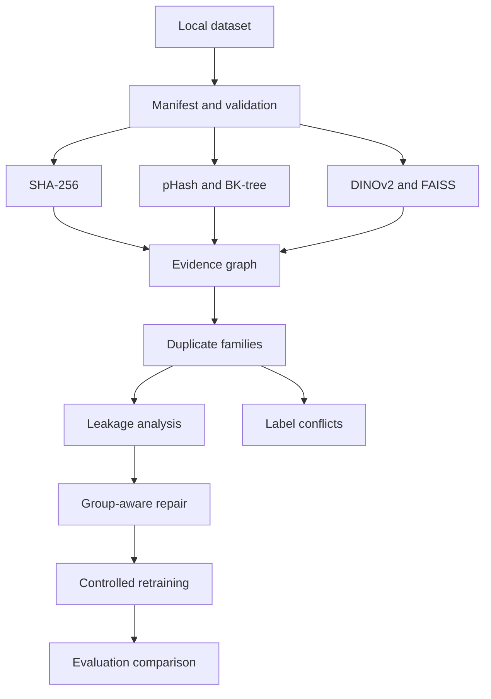

# SplitGuard Vision

SplitGuard Vision is a local-first dataset integrity system for image-classification
workflows. It is designed to detect exact and transformed duplicate leakage across
training, validation, and test splits, preserve the evidence behind each candidate,
repair contaminated manifests without splitting duplicate families, and measure how
the repair changes model evaluation.

> **Implementation status:** active development. Benchmark and training numbers will
> only be published after their generating commands have completed and the raw result
> artifacts have been retained.

## Intended pipeline



The project does not use an LLM or upload images to a hosted service. Production
embedding weights and CIFAR-10 are downloaded only by explicit commands; offline
tests and the local demo use generated images and deterministic fake embeddings.

## Development

The reproducible baseline is Python 3.11 on Windows and Linux CPU:

```bash
uv sync --frozen
uv run ruff check .
uv run mypy src
uv run pytest
```

See the commit history for completed engineering phases. Detailed architecture,
measured results, CLI usage, privacy guarantees, and limitations will be added as
their implementations and generated artifacts are verified.

## License

MIT
