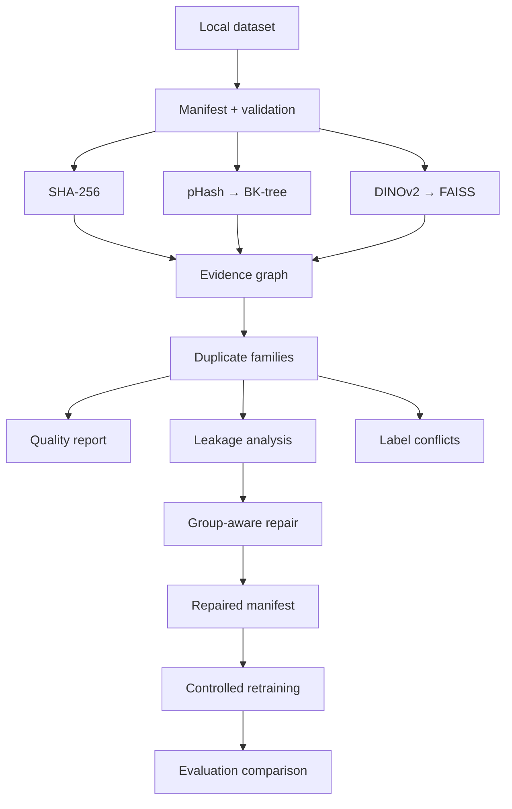

# SplitGuard Vision

[](https://github.com/Sahil-Arifi/splitguard-vision/actions/workflows/ci.yml)

SplitGuard Vision is a local-first integrity pipeline for image-classification
datasets. It finds exact and transformed duplicate leakage across train, validation,
and test splits; preserves the evidence behind every candidate; builds transitive
duplicate families; repairs contaminated manifests without breaking those families;
and measures what the repair does to model evaluation.

This is deliberately more than a duplicate-image script. The repository includes an
indexed three-layer detector, an evidence graph, a constrained split optimizer,
detector ground truth, 1k/5k/10k runtime measurements, a three-seed CIFAR-10
evaluation-integrity experiment, and a completely local HTML/Markdown review bundle.
The raw artifacts behind every number below are committed in [`artifacts/`](artifacts/).

## Why split leakage matters

Evaluation assumes that test examples are independent of training. A byte-identical
copy, a recompressed export, or another view of the same source can let a model see
the answer's visual content during training. The resulting score may describe
memorization or source overlap rather than generalization. Leakage can also hide
label conflicts: two copies of the same content may carry different class names.

SplitGuard keeps three concepts separate:

| Evidence | What it establishes | Default treatment |
|---|---|---|
| SHA-256 equality | Files are byte-identical | Definite duplicate |
| 64-bit pHash within a Hamming radius | Low-frequency visual structure is close | Definite transformed duplicate |
| DINOv2 cosine similarity only | Images are semantically/visually close | Review candidate, not definite leakage |

Embedding similarity is intentionally not converted into identity by default. A dog
next to another dog can be a useful neighbor without being a duplicate.

## System architecture



### Data flow

1. **Ingest.** Discover an ImageFolder tree or parse `path,split,label` CSV rows.
   Stable IDs come from normalized relative paths, never machine-specific absolute
   paths.
2. **Validate.** Check existence and file type, decode with Pillow, enforce a decoded
   pixel limit, normalize processing to RGB, and record dimensions, format, and
   SHA-256. Malformed inputs become explicit issues; they are not silently skipped.
3. **Detect.** Group equal SHA values, query 64-bit pHashes through a BK-tree, and
   retrieve normalized DINOv2 neighbors with FAISS HNSW. FlatIP remains available as
   an exact reference.
4. **Explain.** Merge independent evidence into typed edges: `exact`,
   `transformed_duplicate`, or `semantic_candidate`, with the original SHA, Hamming,
   and cosine fields intact.
5. **Group.** Union policy-approved definite edges into connected components. If A
   matches B and B matches C, all three remain one family even when A and C do not
   independently cross a threshold. Semantic-only review edges are not unioned.
6. **Audit.** Count train→validation, train→test, and validation→test leakage; identify
   cross-label families; and retain representative evidence for local review.
7. **Repair.** Assign each definite family as one indivisible group, write a new CSV
   manifest, and leave source files unchanged.

### Why pHash and embeddings are both present

The internal pHash takes a 2-D DCT, thresholds 64 low-frequency coefficients, and
compares the resulting 64-bit integers with Hamming distance. It is transparent and
effective for many compression, resize, brightness, and blur changes, but cropping
can shift the entire frequency layout.

The BK-tree prunes Hamming-distance searches using the metric triangle inequality,
avoiding the production path's naive all-pairs loop. Tests compare every indexed
result with a brute-force reference.

DINOv2 contributes a different signal: a pinned `facebook/dinov2-small` revision,
pooled representation, inference-only evaluation mode, and L2 normalization for
cosine retrieval. A content/model/preprocessing key protects the local embedding
cache. FAISS HNSW supplies approximate retrieval; FlatIP measures its recall rather
than assuming equivalence.

### Group-aware repair

Every definite connected component is a hard assignment unit; unconnected images are
singleton groups. The deterministic optimizer first performs a constrained greedy
assignment and then bounded local improvement. It minimizes

```text
J = w_size × (half-L1 split-ratio error)
  + w_class × (target-ratio-weighted Jensen-Shannon class divergence)
```

The duplicate-family invariant is never relaxed to improve this objective. When a
large family makes the requested ratios impossible, the result records that
infeasibility instead of disguising it. `repair` writes only a manifest. The separate,
explicit `materialize` command can copy or symlink a new tree.

## Measured results

Tables are rounded for reading; the linked JSON retains full precision, run metadata,
package versions, configuration and dataset hashes, seeds, and the producing Git SHA.
These are controlled one-host measurements, not general performance claims.

### Controlled detector benchmark

[`detection_benchmark.json`](artifacts/detection_benchmark.json) was generated from 16
deterministic source images per corruption family. Each positive relationship and its
decoded-distinct negative control came from the fixture ground truth—not from a
detector. The valid families below contain 16 positives each. The malformed-image
case is validation-only and is excluded from precision/recall scoring.

The DINO column is a real CPU run of the pinned model revision. The combined policy
uses exact SHA plus pHash at radius 8; embedding-only matches remain review-only.
Each cell is **precision / recall / F1** at that detector's best measured threshold.

| Corruption | SHA-256 | pHash best radius | DINOv2 best cosine | Combined policy |
|---|---:|---:|---:|---:|
| Exact copy | 1 / 1 / 1 | 1 / 1 / 1 @ 0 | 1 / 1 / 1 @ 0.95 | 1 / 1 / 1 |
| Cross-split copy | 1 / 1 / 1 | 1 / 1 / 1 @ 0 | 1 / 1 / 1 @ 0.95 | 1 / 1 / 1 |
| Cross-label duplicate | 1 / 1 / 1 | 1 / 1 / 1 @ 0 | 1 / 1 / 1 @ 0.95 | 1 / 1 / 1 |
| JPEG recompression | 0 / 0 / 0 | 1 / 1 / 1 @ 4 | 0.695652 / 1 / 0.820513 @ 0.80 | 1 / 1 / 1 |
| Resize | 0 / 0 / 0 | 1 / 1 / 1 @ 6 | 0.9 / 0.5625 / 0.692308 @ 0.90 | 1 / 1 / 1 |
| Brightness shift | 0 / 0 / 0 | 1 / 1 / 1 @ 6 | 1 / 1 / 1 @ 0.95 | 1 / 1 / 1 |
| Gaussian blur | 0 / 0 / 0 | 1 / 1 / 1 @ 6 | 1 / 0.1875 / 0.315789 @ 0.80 | 1 / 1 / 1 |
| Small crop | 0 / 0 / 0 | 1 / 0.5 / 0.666667 @ 12 | 1 / 0.875 / 0.933333 @ 0.95 | 1 / 0.125 / 0.222222 |


The controlled fixture shows why evidence stays layered: pHash handled seven families
perfectly at a measured radius, while the fixed combined radius missed 14 of 16 crop
pairs. DINOv2 recovered 14 crop pairs at cosine 0.95, but its JPEG threshold also
admitted seven false positives. That is evidence for review and domain calibration,
not a universal threshold recommendation.

### Runtime and approximate-search reference

[`scaling_benchmark.json`](artifacts/scaling_benchmark.json) measures deterministic
local PNG collections on one Windows CPU run. Image embedding in this benchmark uses
64-dimensional **pixel-derived `FakeEmbedder` vectors, not DINOv2**, so the timing
exercises the pipeline without presenting synthetic vectors as production-model
performance.

| Images | Validation + SHA | pHash compute | BK-tree query | Fake embedding | FlatIP query | HNSW query | HNSW recall@10 | Total local audit |
|---:|---:|---:|---:|---:|---:|---:|---:|---:|
| 1,000 | 3.163874 s | 0.715737 s | 2.267658 s | 0.549868 s | 0.382207 s | 0.380826 s | 1.000000 | 7.576961 s |
| 5,000 | 15.128625 s | 4.423667 s | 38.352205 s | 2.576908 s | 1.635600 s | 2.129361 s | 0.999920 | 65.147397 s |
| 10,000 | 30.113019 s | 8.882682 s | 141.835284 s | 4.252682 s | 2.679764 s | 3.699943 s | 0.999750 | 193.467383 s |

At 1,000 images, brute-force Hamming query took **0.253314 s** versus **2.267658
s** for the BK-tree. That small-N fixture favors the vectorized brute-force reference;
brute force was intentionally not run at 5k or 10k. HNSW recall against exact FlatIP
was 100%, 99.992%, and 99.975%, but HNSW query was slower than FlatIP at 5k and 10k
here. Approximate search is therefore measured—not advertised as automatically faster
or equivalent. Reported memory values cover Python allocations observed by
`tracemalloc`; a misleading total-process peak is omitted.


### Offline demo repair

The generated six-file demo contains one source image plus an exact train/test copy,
a JPEG recompression, a resize, a conflicting-label copy, and one corrupt file. Five
images decode; the corrupt image is reported explicitly. Transitivity puts all five
valid images in one definite family.

| Repair measure | Before | After |
|---|---:|---:|
| Definite cross-split leakage families | 1 | 0 |
| Split-size error | 0.4 | 0.4 |
| Class-distribution divergence | 0.101046 | 0.4 |
| Images moved | — | 4 |
| Hard family invariant | — | satisfied |

The requested 60/20/20 integer targets were 3/1/1, but the indivisible family has five
members. The optimizer correctly records that exact balance is impossible and places
the family together rather than leaking it across splits. See
[`audit.json`](artifacts/audit.json), [`repair.json`](artifacts/repair.json), and
[`repaired_manifest.csv`](artifacts/repaired_manifest.csv).


### CIFAR-10 evaluation-integrity experiment

[`training_results.json`](artifacts/training_results.json) records a controlled CPU
experiment, not a state-of-the-art accuracy run:

- 3,000 train, 500 validation, and 1,000 shared clean holdout images;
- 200 resize-derived train/test families injected independently of the detector;
- the same compact CNN, AdamW optimizer, cosine schedule, three epochs, no
  augmentation, and seeds 7, 42, and 101 for both conditions;
- a real SplitGuard group repair, reducing 200 leaking families to zero while keeping
  the configured split sizes exact; and
- accuracy evaluated on the same 1,000-image clean holdout for the fair paired
  comparison.

| Condition | Train | Validation | Shared clean holdout | All condition test | Non-injected condition test | Injected derivatives in actual test |
|---|---:|---:|---:|---:|---:|---:|
| Contaminated, 3-seed mean | 0.467667 | 0.458667 | 0.430000 | 0.415000 | 0.430000 | 0.340000 (n=200/seed) |
| Repaired, 3-seed mean | 0.468778 | 0.447333 | 0.425667 | 0.422778 | 0.423681 | 0.333333 (n=12/seed) |
| Repaired − contaminated | +0.001111 | −0.011333 | **−0.004333** | +0.007778 | −0.006319 | not a matched cohort |


The primary paired result is the shared clean holdout: repair changed mean accuracy
from 43.0000% to 42.5667%, a **−0.4333 percentage-point** difference. Seed-level
deltas were mixed. This run does **not** establish that leakage inflated clean-holdout
accuracy. The repaired all-test score increased by 0.7778 points, but its condition
composition changed; the injected subsets are especially incomparable because 200
derivatives remain in each contaminated test versus 12 in each repaired test.

The repair moved 376 images, preserved zero split-size error, changed weighted class
Jensen-Shannon divergence from 0 to 0.0000120307, and satisfied the hard invariant.
Its bounded local search records that candidate swaps were capped at 4,096 pairs.

## Local report

[`report.html`](artifacts/report.html) and [`report.md`](artifacts/report.md) are
generated from the validated JSON—not manually edited result summaries. The local
bundle contains summary cards, invalid files, duplicate/leakage/conflict evidence,
repair statistics, benchmark tables, provenance, charts, and SHA-verified synthetic
thumbnails. Use `--no-thumbnails` for sensitive datasets.

## Reproduce

Prerequisites are Python 3.11+ and
[`uv`](https://docs.astral.sh/uv/). The lockfile pins a Windows/Linux CPU environment;
the first sync downloads packages.

```bash
git clone https://github.com/Sahil-Arifi/splitguard-vision.git
cd splitguard-vision
uv sync --frozen
uv run splitguard --help
```

The zero-network demo uses generated images and `FakeEmbedder`:

```bash
uv run splitguard demo
# or: bash scripts/demo.sh
```

It creates ignored `demo-data/` input plus `artifacts/demo/` output, audits and repairs
the fixture, verifies that source bytes did not change, and writes HTML and Markdown
reports.

### Audit an ImageFolder dataset

```text
dataset/
├── train/cat/a.jpg
├── train/dog/b.jpg
├── val/cat/c.jpg
└── test/dog/d.jpg
```

```bash
uv run splitguard scan dataset
uv run splitguard audit dataset --config configs/default.yaml
uv run splitguard repair artifacts/audit.json --ratios 0.8,0.1,0.1
uv run splitguard report \
  --audit artifacts/audit.json \
  --repair artifacts/repair.json \
  --dataset-root dataset
```

The production audit may download the pinned DINOv2 files on first use. Inference and
all image processing remain local. Disable that layer explicitly when only exact and
pHash evidence is desired:

```bash
uv run splitguard audit dataset --no-embeddings
```

### Audit a CSV manifest

```csv
path,split,label
images/a.jpg,train,cat
images/b.jpg,test,cat
```

```bash
uv run splitguard audit manifest.csv --dataset-root /path/to/local/root
```

Paths are normalized and must remain inside the supplied root.

### Optional materialization

Repair never rearranges source files. To explicitly create a separate tree:

```bash
uv run splitguard materialize \
  artifacts/repaired_manifest.csv repaired-dataset \
  --dataset-root dataset --mode copy
```

The output must not already exist. `--mode symlink` is also available where the OS
permits it.

### Re-run the measured workflows

```bash
uv run splitguard benchmark-detection --config configs/benchmark.yaml
uv run splitguard benchmark-scale --config configs/benchmark.yaml
uv run splitguard experiment --config configs/cifar10_experiment.yaml
uv run splitguard report \
  --audit artifacts/audit.json \
  --repair artifacts/repair.json \
  --detection-benchmark artifacts/detection_benchmark.json \
  --scaling-benchmark artifacts/scaling_benchmark.json \
  --training-results artifacts/training_results.json
```

The detector benchmark may fetch pinned DINOv2 model files. The experiment is the only
workflow that fetches CIFAR-10, and neither is run in CI.

## CLI

| Command | Purpose |
|---|---|
| `scan DATASET` | Discover and strictly validate ImageFolder or CSV input |
| `audit DATASET` | Produce evidence, families, leakage, conflicts, and `audit.json` |
| `repair AUDIT_JSON --ratios ...` | Optimize group-aware assignments and write a new manifest |
| `materialize MANIFEST OUTPUT_DIR` | Explicitly copy or symlink a separate repaired tree |
| `benchmark-detection` | Inject controlled defects and score each detector layer |
| `benchmark-scale` | Measure local pipeline and exact/approximate indexes |
| `experiment` | Run matched contaminated/repaired CIFAR-10 training |
| `report --audit ...` | Generate local HTML, Markdown, charts, and optional thumbnails |
| `demo` | Exercise the complete workflow offline on generated images |

Every command provides `--help`, emits concise JSON summaries, and avoids printing
image bytes or absolute source paths.

## Configuration

All YAML is validated by strict Pydantic models; unknown keys and ratios outside a
defensible sum-to-one tolerance are rejected. [`configs/default.yaml`](configs/default.yaml)
controls decoded-pixel limits, thumbnails/cache, pHash, DINOv2 device/batching,
FAISS, evidence policy, repair ratios/weights/seed, and report output. The benchmark
and experiment configurations are retained beside their raw artifacts:

- [`configs/benchmark.yaml`](configs/benchmark.yaml): detector threshold sweeps,
  pinned embedding identity, index settings, and 1k/5k/10k sizes.
- [`configs/cifar10_experiment.yaml`](configs/cifar10_experiment.yaml): data sample
  sizes, contamination, repair settings, architecture controls, and all three seeds.

## Artifacts

| Artifact | Contents |
|---|---|
| [`audit.json`](artifacts/audit.json) | Valid/invalid records, evidence graph, families, leakage, conflicts |
| [`repair.json`](artifacts/repair.json) | Assignments, hard-invariant result, before/after statistics, objective |
| [`repaired_manifest.csv`](artifacts/repaired_manifest.csv) | New split assignment only; no source mutation |
| [`detection_benchmark.json`](artifacts/detection_benchmark.json) | Per-family SHA/pHash/DINO/combined precision, recall, F1 |
| [`scaling_benchmark.json`](artifacts/scaling_benchmark.json) | Stage timings, memory scope, FlatIP/HNSW recall |
| [`training_results.json`](artifacts/training_results.json) | Six runs, per-class metrics, 200-family ground truth, manifests, repair proof |
| [`report.html`](artifacts/report.html) / [`report.md`](artifacts/report.md) | Generated static review outputs |

## Tests and CI

Tests use generated Pillow images, deterministic arrays, and `FakeEmbedder`; they do
not download DINOv2, CIFAR-10, or pretrained weights. Coverage includes strict config
and manifests, JPEG/PNG/malformed validation, exact/pHash/embedding evidence, BK-tree
parity, FAISS mapping and recall, graph transitivity, leakage boundaries, label
conflicts, repair invariants and edge cases, corruption ground truth, metrics,
serialization, reporting/privacy, the network-denied demo, and CLI smoke paths.

```bash
uv lock --check
uv sync --frozen
uv run ruff check .
uv run mypy src
uv run pytest
```

GitHub Actions runs that exact offline gate on Ubuntu and Windows with Python 3.11 and
requires at least 85% branch-aware coverage.

## Privacy and security model

- Image decoding, hashes, embeddings, indexes, repair, and reporting run locally.
- No hosted API, telemetry, LLM, or remote image upload is part of the pipeline.
- Stable IDs and relative paths replace absolute machine paths in shareable outputs.
- Source images are read-only; default repair writes a manifest, never in-place moves
  or deletion.
- Thumbnails stay under the chosen artifact directory and can be disabled entirely.
- Dataset roots, CIFAR-10, DINO weights, caches, demo data, virtual environments,
  credentials, and tokens are ignored by Git. Only generated synthetic thumbnails
  are published here.

## Scope relative to existing tools

SplitGuard is complementary, not claimed superior. [Cleanlab Datalab](https://docs.cleanlab.ai/stable/cleanlab/datalab/guide/issue_type_description.html)
covers broad model/feature-driven data issues including labels, outliers, and near
duplicates. [FiftyOne](https://docs.voxel51.com/user_guide/evaluation/index.html)
provides interactive dataset exploration and model evaluation. Commercial data
platforms often add collaborative annotation, governance, and operational workflows.

This portfolio's narrower contribution is one reproducible split-integrity chain:
detector evidence → objective injected ground truth → transitive grouping → hard-safe
split repair → controlled evaluation-impact measurement → local static report. No
head-to-head product benchmark was run, so the repository makes no quality ranking.

## Known limitations

- Detector measurements use 16 generated sources per family on one host. Real domains
  need labeled duplicate pairs and threshold calibration.
- The fixed pHash policy is weak on small crops; semantic DINO neighbors remain review
  candidates because similarity is not identity.
- Scaling stops at 10,000 images, uses fake pixel-derived embeddings, and measures one
  Windows CPU environment. Neither BK-tree nor HNSW was faster in every measured case.
- The published lock selects CPU PyTorch. CUDA paths exist but were not exercised or
  packaged as a separate reproducible GPU lock.
- CIFAR-10 uses a small 3,000-image training sample, three epochs, one resize
  contamination scheme, and three seeds. It cannot establish a general causal effect
  of leakage.
- Repaired and contaminated injected-only test subsets have different membership and
  size; only the shared clean holdout is a fair paired comparison.
- Greedy plus bounded local improvement is deterministic and hard-safe, but not a
  proof of globally optimal class balance.
- The generated demo intentionally creates one oversized transitive family, so its
  requested split balance is infeasible.

## Strongest next improvement

Build a larger, domain-diverse, human-labeled pair benchmark and calibrate the
definite/review policy against it. That would test crop robustness, quantify false
positives on naturally similar non-duplicates, and turn the controlled thresholds
into defensible deployment guidance. Follow with larger repeated training experiments
covering multiple corruption families and a separately pinned CUDA environment.

## License

[MIT](LICENSE)
