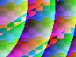
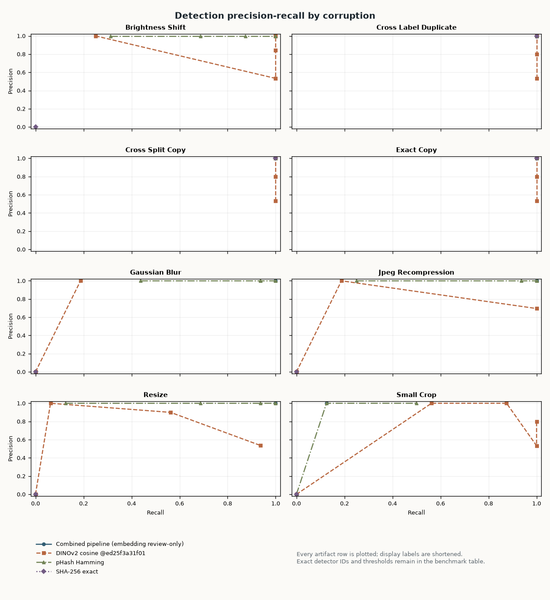
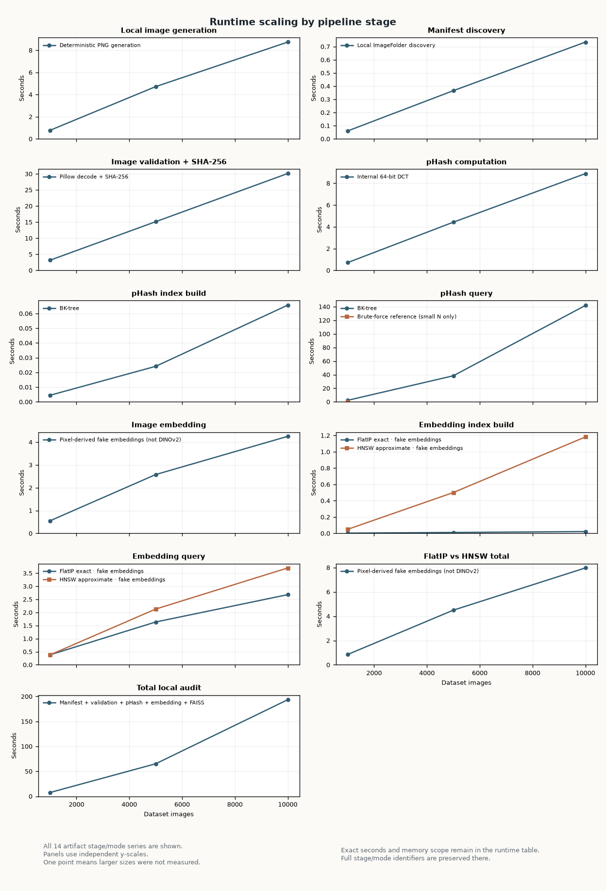
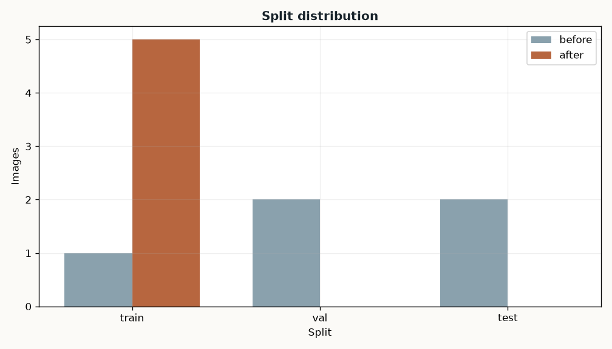
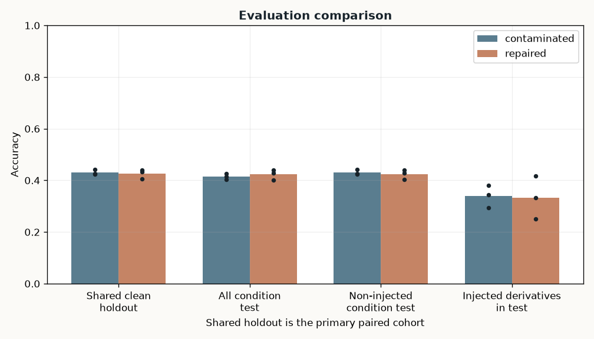

# SplitGuard Vision integrity report

Generated locally from strict JSON artifacts. Display values are rounded; source JSON retains full precision. Semantic-only neighbors remain review candidates.

## Summary

| Metric | Value |
| --- | --- |
| Valid images | 5 |
| Invalid images | 1 |
| Definite leakage groups | 1 |
| Contaminated images | 5 |
| Contaminated evaluation fraction | 1.000000 |
| Semantic-only review candidates | 0 |
| Cross-label conflicts | 1 |

## Split statistics

| Split | Images |
| --- | --- |
| train | 1 |
| val | 2 |
| test | 2 |

### Class distribution

| Split | Class | Images |
| --- | --- | --- |
| train | cat | 1 |
| val | cat | 1 |
| val | dog | 1 |
| test | cat | 2 |

## Invalid files

| Record | Relative path | Split | Label | Code | Message |
| --- | --- | --- | --- | --- | --- |
| img_b22085c821aa696e29002512 | test/cat/corrupt.png | test | cat | malformed_image | image could not be decoded |

## Exact duplicate groups

| Family | Members | Splits | Labels | Evidence | Member IDs |
| --- | --- | --- | --- | --- | --- |
| family_f4f24c2c9b763fb84b88f822 | 5 | train, val, test | cat, dog | exact, transformed_duplicate | img_47d267bbd334ff82d9262ebe, img_4fa94cb52e682883761ee588, img_60dfa70df86b98f0e01a2209, img_f4aa34d18f2b91b90fd1b56e, img_fcd841e84d92a918cb4faef9 |

## Near-duplicate groups

| Family | Members | Splits | Labels | Evidence | Member IDs |
| --- | --- | --- | --- | --- | --- |
| family_f4f24c2c9b763fb84b88f822 | 5 | train, val, test | cat, dog | exact, transformed_duplicate | img_47d267bbd334ff82d9262ebe, img_4fa94cb52e682883761ee588, img_60dfa70df86b98f0e01a2209, img_f4aa34d18f2b91b90fd1b56e, img_fcd841e84d92a918cb4faef9 |

## Cross-split leakage

| Family | Boundaries | Strongest evidence | Label conflict | Labels | Members |
| --- | --- | --- | --- | --- | --- |
| family_f4f24c2c9b763fb84b88f822 | train-val, train-test, val-test | exact | yes | cat, dog | img_47d267bbd334ff82d9262ebe, img_4fa94cb52e682883761ee588, img_60dfa70df86b98f0e01a2209, img_f4aa34d18f2b91b90fd1b56e, img_fcd841e84d92a918cb4faef9 |

## Label conflicts

| Family | Kind | Labels | Members |
| --- | --- | --- | --- |
| family_f4f24c2c9b763fb84b88f822 | exact_duplicate | cat, dog | img_47d267bbd334ff82d9262ebe, img_4fa94cb52e682883761ee588, img_60dfa70df86b98f0e01a2209, img_f4aa34d18f2b91b90fd1b56e, img_fcd841e84d92a918cb4faef9 |

## Similarity evidence

| Left | Right | Classification | Decision | Exact | pHash distance | Cosine | Confidence |
| --- | --- | --- | --- | --- | --- | --- | --- |
| img_47d267bbd334ff82d9262ebe | img_4fa94cb52e682883761ee588 | transformed_duplicate | definite | no | 0 | — | 1.000000 |
| img_47d267bbd334ff82d9262ebe | img_60dfa70df86b98f0e01a2209 | transformed_duplicate | definite | no | 0 | — | 1.000000 |
| img_47d267bbd334ff82d9262ebe | img_f4aa34d18f2b91b90fd1b56e | transformed_duplicate | definite | no | 0 | — | 1.000000 |
| img_47d267bbd334ff82d9262ebe | img_fcd841e84d92a918cb4faef9 | transformed_duplicate | definite | no | 0 | — | 1.000000 |
| img_4fa94cb52e682883761ee588 | img_60dfa70df86b98f0e01a2209 | transformed_duplicate | definite | no | 0 | — | 1.000000 |
| img_4fa94cb52e682883761ee588 | img_f4aa34d18f2b91b90fd1b56e | exact | definite | yes | 0 | 1.000000 | 1.000000 |
| img_4fa94cb52e682883761ee588 | img_fcd841e84d92a918cb4faef9 | exact | definite | yes | 0 | 1.000000 | 1.000000 |
| img_60dfa70df86b98f0e01a2209 | img_f4aa34d18f2b91b90fd1b56e | transformed_duplicate | definite | no | 0 | — | 1.000000 |
| img_60dfa70df86b98f0e01a2209 | img_fcd841e84d92a918cb4faef9 | transformed_duplicate | definite | no | 0 | — | 1.000000 |
| img_f4aa34d18f2b91b90fd1b56e | img_fcd841e84d92a918cb4faef9 | exact | definite | yes | 0 | 1.000000 | 1.000000 |

## Representative thumbnails

Generated 5 local thumbnails; skipped 0.

`img_47d267bbd334ff82d9262ebe` · val · cat · `val/cat/resized.png`

`img_4fa94cb52e682883761ee588` · val · dog · `val/dog/conflicting-label.png`

`img_60dfa70df86b98f0e01a2209` · test · cat · `test/cat/jpeg-recompressed.jpg`

`img_f4aa34d18f2b91b90fd1b56e` · test · cat · `test/cat/exact-duplicate.png`

`img_fcd841e84d92a918cb4faef9` · train · cat · `train/cat/source.png`

## Repair summary

| Metric | Value |
| --- | --- |
| Objective value | 0.800000 |
| Split-size error before | 0.400000 |
| Split-size error after | 0.400000 |
| Class divergence before | 0.101046 |
| Class divergence after | 0.400000 |
| Definite leakage groups before | 1 |
| Definite leakage groups after | 0 |
| Moved images | 4 |
| Hard family invariant | satisfied |

### Repair split distribution

| Split | Before | After | Classes before | Classes after |
| --- | --- | --- | --- | --- |
| train | 1 | 5 | {'cat': 1} | {'cat': 4, 'dog': 1} |
| val | 2 | 0 | {'cat': 1, 'dog': 1} | {} |
| test | 2 | 0 | {'cat': 2} | {} |

## Detection benchmark

| Detector | Corruption | Threshold | Precision | Recall | F1 | TP | FP | FN |
| --- | --- | --- | --- | --- | --- | --- | --- | --- |
| combined_exact_phash_embedding_review_only | brightness_shift | — | 1.000000 | 1.000000 | 1.000000 | 16 | 0 | 0 |
| combined_exact_phash_embedding_review_only | cross_label_duplicate | — | 1.000000 | 1.000000 | 1.000000 | 16 | 0 | 0 |
| combined_exact_phash_embedding_review_only | cross_split_copy | — | 1.000000 | 1.000000 | 1.000000 | 16 | 0 | 0 |
| combined_exact_phash_embedding_review_only | exact_copy | — | 1.000000 | 1.000000 | 1.000000 | 16 | 0 | 0 |
| combined_exact_phash_embedding_review_only | gaussian_blur | — | 1.000000 | 1.000000 | 1.000000 | 16 | 0 | 0 |
| combined_exact_phash_embedding_review_only | jpeg_recompression | — | 1.000000 | 1.000000 | 1.000000 | 16 | 0 | 0 |
| combined_exact_phash_embedding_review_only | resize | — | 1.000000 | 1.000000 | 1.000000 | 16 | 0 | 0 |
| combined_exact_phash_embedding_review_only | small_crop | — | 1.000000 | 0.125000 | 0.222222 | 2 | 0 | 14 |
| dinov2_embedding_cosine@ed25f3a31f01 | brightness_shift | 0.800000 | 0.533333 | 1.000000 | 0.695652 | 16 | 14 | 0 |
| dinov2_embedding_cosine@ed25f3a31f01 | brightness_shift | 0.900000 | 0.842105 | 1.000000 | 0.914286 | 16 | 3 | 0 |
| dinov2_embedding_cosine@ed25f3a31f01 | brightness_shift | 0.950000 | 1.000000 | 1.000000 | 1.000000 | 16 | 0 | 0 |
| dinov2_embedding_cosine@ed25f3a31f01 | brightness_shift | 0.970000 | 1.000000 | 1.000000 | 1.000000 | 16 | 0 | 0 |
| dinov2_embedding_cosine@ed25f3a31f01 | brightness_shift | 0.990000 | 1.000000 | 0.250000 | 0.400000 | 4 | 0 | 12 |
| dinov2_embedding_cosine@ed25f3a31f01 | cross_label_duplicate | 0.800000 | 0.533333 | 1.000000 | 0.695652 | 16 | 14 | 0 |
| dinov2_embedding_cosine@ed25f3a31f01 | cross_label_duplicate | 0.900000 | 0.800000 | 1.000000 | 0.888889 | 16 | 4 | 0 |
| dinov2_embedding_cosine@ed25f3a31f01 | cross_label_duplicate | 0.950000 | 1.000000 | 1.000000 | 1.000000 | 16 | 0 | 0 |
| dinov2_embedding_cosine@ed25f3a31f01 | cross_label_duplicate | 0.970000 | 1.000000 | 1.000000 | 1.000000 | 16 | 0 | 0 |
| dinov2_embedding_cosine@ed25f3a31f01 | cross_label_duplicate | 0.990000 | 1.000000 | 1.000000 | 1.000000 | 16 | 0 | 0 |
| dinov2_embedding_cosine@ed25f3a31f01 | cross_split_copy | 0.800000 | 0.533333 | 1.000000 | 0.695652 | 16 | 14 | 0 |
| dinov2_embedding_cosine@ed25f3a31f01 | cross_split_copy | 0.900000 | 0.800000 | 1.000000 | 0.888889 | 16 | 4 | 0 |
| dinov2_embedding_cosine@ed25f3a31f01 | cross_split_copy | 0.950000 | 1.000000 | 1.000000 | 1.000000 | 16 | 0 | 0 |
| dinov2_embedding_cosine@ed25f3a31f01 | cross_split_copy | 0.970000 | 1.000000 | 1.000000 | 1.000000 | 16 | 0 | 0 |
| dinov2_embedding_cosine@ed25f3a31f01 | cross_split_copy | 0.990000 | 1.000000 | 1.000000 | 1.000000 | 16 | 0 | 0 |
| dinov2_embedding_cosine@ed25f3a31f01 | exact_copy | 0.800000 | 0.533333 | 1.000000 | 0.695652 | 16 | 14 | 0 |
| dinov2_embedding_cosine@ed25f3a31f01 | exact_copy | 0.900000 | 0.800000 | 1.000000 | 0.888889 | 16 | 4 | 0 |
| dinov2_embedding_cosine@ed25f3a31f01 | exact_copy | 0.950000 | 1.000000 | 1.000000 | 1.000000 | 16 | 0 | 0 |
| dinov2_embedding_cosine@ed25f3a31f01 | exact_copy | 0.970000 | 1.000000 | 1.000000 | 1.000000 | 16 | 0 | 0 |
| dinov2_embedding_cosine@ed25f3a31f01 | exact_copy | 0.990000 | 1.000000 | 1.000000 | 1.000000 | 16 | 0 | 0 |
| dinov2_embedding_cosine@ed25f3a31f01 | gaussian_blur | 0.800000 | 1.000000 | 0.187500 | 0.315789 | 3 | 0 | 13 |
| dinov2_embedding_cosine@ed25f3a31f01 | gaussian_blur | 0.900000 | 0.000000 | 0.000000 | 0.000000 | 0 | 0 | 16 |
| dinov2_embedding_cosine@ed25f3a31f01 | gaussian_blur | 0.950000 | 0.000000 | 0.000000 | 0.000000 | 0 | 0 | 16 |
| dinov2_embedding_cosine@ed25f3a31f01 | gaussian_blur | 0.970000 | 0.000000 | 0.000000 | 0.000000 | 0 | 0 | 16 |
| dinov2_embedding_cosine@ed25f3a31f01 | gaussian_blur | 0.990000 | 0.000000 | 0.000000 | 0.000000 | 0 | 0 | 16 |
| dinov2_embedding_cosine@ed25f3a31f01 | jpeg_recompression | 0.800000 | 0.695652 | 1.000000 | 0.820513 | 16 | 7 | 0 |
| dinov2_embedding_cosine@ed25f3a31f01 | jpeg_recompression | 0.900000 | 1.000000 | 0.187500 | 0.315789 | 3 | 0 | 13 |
| dinov2_embedding_cosine@ed25f3a31f01 | jpeg_recompression | 0.950000 | 0.000000 | 0.000000 | 0.000000 | 0 | 0 | 16 |
| dinov2_embedding_cosine@ed25f3a31f01 | jpeg_recompression | 0.970000 | 0.000000 | 0.000000 | 0.000000 | 0 | 0 | 16 |
| dinov2_embedding_cosine@ed25f3a31f01 | jpeg_recompression | 0.990000 | 0.000000 | 0.000000 | 0.000000 | 0 | 0 | 16 |
| dinov2_embedding_cosine@ed25f3a31f01 | resize | 0.800000 | 0.535714 | 0.937500 | 0.681818 | 15 | 13 | 1 |
| dinov2_embedding_cosine@ed25f3a31f01 | resize | 0.900000 | 0.900000 | 0.562500 | 0.692308 | 9 | 1 | 7 |
| dinov2_embedding_cosine@ed25f3a31f01 | resize | 0.950000 | 1.000000 | 0.062500 | 0.117647 | 1 | 0 | 15 |
| dinov2_embedding_cosine@ed25f3a31f01 | resize | 0.970000 | 0.000000 | 0.000000 | 0.000000 | 0 | 0 | 16 |
| dinov2_embedding_cosine@ed25f3a31f01 | resize | 0.990000 | 0.000000 | 0.000000 | 0.000000 | 0 | 0 | 16 |
| dinov2_embedding_cosine@ed25f3a31f01 | small_crop | 0.800000 | 0.533333 | 1.000000 | 0.695652 | 16 | 14 | 0 |
| dinov2_embedding_cosine@ed25f3a31f01 | small_crop | 0.900000 | 0.800000 | 1.000000 | 0.888889 | 16 | 4 | 0 |
| dinov2_embedding_cosine@ed25f3a31f01 | small_crop | 0.950000 | 1.000000 | 0.875000 | 0.933333 | 14 | 0 | 2 |
| dinov2_embedding_cosine@ed25f3a31f01 | small_crop | 0.970000 | 1.000000 | 0.562500 | 0.720000 | 9 | 0 | 7 |
| dinov2_embedding_cosine@ed25f3a31f01 | small_crop | 0.990000 | 0.000000 | 0.000000 | 0.000000 | 0 | 0 | 16 |
| phash_hamming | brightness_shift | 0.000000 | 1.000000 | 0.312500 | 0.476190 | 5 | 0 | 11 |
| phash_hamming | brightness_shift | 2.000000 | 1.000000 | 0.687500 | 0.814815 | 11 | 0 | 5 |
| phash_hamming | brightness_shift | 4.000000 | 1.000000 | 0.875000 | 0.933333 | 14 | 0 | 2 |
| phash_hamming | brightness_shift | 6.000000 | 1.000000 | 1.000000 | 1.000000 | 16 | 0 | 0 |
| phash_hamming | brightness_shift | 8.000000 | 1.000000 | 1.000000 | 1.000000 | 16 | 0 | 0 |
| phash_hamming | brightness_shift | 12.000000 | 1.000000 | 1.000000 | 1.000000 | 16 | 0 | 0 |
| phash_hamming | cross_label_duplicate | 0.000000 | 1.000000 | 1.000000 | 1.000000 | 16 | 0 | 0 |
| phash_hamming | cross_label_duplicate | 2.000000 | 1.000000 | 1.000000 | 1.000000 | 16 | 0 | 0 |
| phash_hamming | cross_label_duplicate | 4.000000 | 1.000000 | 1.000000 | 1.000000 | 16 | 0 | 0 |
| phash_hamming | cross_label_duplicate | 6.000000 | 1.000000 | 1.000000 | 1.000000 | 16 | 0 | 0 |
| phash_hamming | cross_label_duplicate | 8.000000 | 1.000000 | 1.000000 | 1.000000 | 16 | 0 | 0 |
| phash_hamming | cross_label_duplicate | 12.000000 | 1.000000 | 1.000000 | 1.000000 | 16 | 0 | 0 |
| phash_hamming | cross_split_copy | 0.000000 | 1.000000 | 1.000000 | 1.000000 | 16 | 0 | 0 |
| phash_hamming | cross_split_copy | 2.000000 | 1.000000 | 1.000000 | 1.000000 | 16 | 0 | 0 |
| phash_hamming | cross_split_copy | 4.000000 | 1.000000 | 1.000000 | 1.000000 | 16 | 0 | 0 |
| phash_hamming | cross_split_copy | 6.000000 | 1.000000 | 1.000000 | 1.000000 | 16 | 0 | 0 |
| phash_hamming | cross_split_copy | 8.000000 | 1.000000 | 1.000000 | 1.000000 | 16 | 0 | 0 |
| phash_hamming | cross_split_copy | 12.000000 | 1.000000 | 1.000000 | 1.000000 | 16 | 0 | 0 |
| phash_hamming | exact_copy | 0.000000 | 1.000000 | 1.000000 | 1.000000 | 16 | 0 | 0 |
| phash_hamming | exact_copy | 2.000000 | 1.000000 | 1.000000 | 1.000000 | 16 | 0 | 0 |
| phash_hamming | exact_copy | 4.000000 | 1.000000 | 1.000000 | 1.000000 | 16 | 0 | 0 |
| phash_hamming | exact_copy | 6.000000 | 1.000000 | 1.000000 | 1.000000 | 16 | 0 | 0 |
| phash_hamming | exact_copy | 8.000000 | 1.000000 | 1.000000 | 1.000000 | 16 | 0 | 0 |
| phash_hamming | exact_copy | 12.000000 | 1.000000 | 1.000000 | 1.000000 | 16 | 0 | 0 |
| phash_hamming | gaussian_blur | 0.000000 | 1.000000 | 0.437500 | 0.608696 | 7 | 0 | 9 |
| phash_hamming | gaussian_blur | 2.000000 | 1.000000 | 0.937500 | 0.967742 | 15 | 0 | 1 |
| phash_hamming | gaussian_blur | 4.000000 | 1.000000 | 0.937500 | 0.967742 | 15 | 0 | 1 |
| phash_hamming | gaussian_blur | 6.000000 | 1.000000 | 1.000000 | 1.000000 | 16 | 0 | 0 |
| phash_hamming | gaussian_blur | 8.000000 | 1.000000 | 1.000000 | 1.000000 | 16 | 0 | 0 |
| phash_hamming | gaussian_blur | 12.000000 | 1.000000 | 1.000000 | 1.000000 | 16 | 0 | 0 |
| phash_hamming | jpeg_recompression | 0.000000 | 1.000000 | 0.250000 | 0.400000 | 4 | 0 | 12 |
| phash_hamming | jpeg_recompression | 2.000000 | 1.000000 | 0.937500 | 0.967742 | 15 | 0 | 1 |
| phash_hamming | jpeg_recompression | 4.000000 | 1.000000 | 1.000000 | 1.000000 | 16 | 0 | 0 |
| phash_hamming | jpeg_recompression | 6.000000 | 1.000000 | 1.000000 | 1.000000 | 16 | 0 | 0 |
| phash_hamming | jpeg_recompression | 8.000000 | 1.000000 | 1.000000 | 1.000000 | 16 | 0 | 0 |
| phash_hamming | jpeg_recompression | 12.000000 | 1.000000 | 1.000000 | 1.000000 | 16 | 0 | 0 |
| phash_hamming | resize | 0.000000 | 1.000000 | 0.125000 | 0.222222 | 2 | 0 | 14 |
| phash_hamming | resize | 2.000000 | 1.000000 | 0.687500 | 0.814815 | 11 | 0 | 5 |
| phash_hamming | resize | 4.000000 | 1.000000 | 0.937500 | 0.967742 | 15 | 0 | 1 |
| phash_hamming | resize | 6.000000 | 1.000000 | 1.000000 | 1.000000 | 16 | 0 | 0 |
| phash_hamming | resize | 8.000000 | 1.000000 | 1.000000 | 1.000000 | 16 | 0 | 0 |
| phash_hamming | resize | 12.000000 | 1.000000 | 1.000000 | 1.000000 | 16 | 0 | 0 |
| phash_hamming | small_crop | 0.000000 | 0.000000 | 0.000000 | 0.000000 | 0 | 0 | 16 |
| phash_hamming | small_crop | 2.000000 | 0.000000 | 0.000000 | 0.000000 | 0 | 0 | 16 |
| phash_hamming | small_crop | 4.000000 | 0.000000 | 0.000000 | 0.000000 | 0 | 0 | 16 |
| phash_hamming | small_crop | 6.000000 | 0.000000 | 0.000000 | 0.000000 | 0 | 0 | 16 |
| phash_hamming | small_crop | 8.000000 | 1.000000 | 0.125000 | 0.222222 | 2 | 0 | 14 |
| phash_hamming | small_crop | 12.000000 | 1.000000 | 0.500000 | 0.666667 | 8 | 0 | 8 |
| sha256_exact | brightness_shift | — | 0.000000 | 0.000000 | 0.000000 | 0 | 0 | 16 |
| sha256_exact | cross_label_duplicate | — | 1.000000 | 1.000000 | 1.000000 | 16 | 0 | 0 |
| sha256_exact | cross_split_copy | — | 1.000000 | 1.000000 | 1.000000 | 16 | 0 | 0 |
| sha256_exact | exact_copy | — | 1.000000 | 1.000000 | 1.000000 | 16 | 0 | 0 |
| sha256_exact | gaussian_blur | — | 0.000000 | 0.000000 | 0.000000 | 0 | 0 | 16 |
| sha256_exact | jpeg_recompression | — | 0.000000 | 0.000000 | 0.000000 | 0 | 0 | 16 |
| sha256_exact | resize | — | 0.000000 | 0.000000 | 0.000000 | 0 | 0 | 16 |
| sha256_exact | small_crop | — | 0.000000 | 0.000000 | 0.000000 | 0 | 0 | 16 |

### Embedding provenance

| Field | Value |
| --- | --- |
| Backend | dinov2 |
| Model identity | huggingface:facebook/dinov2-small@ed25f3a31f01632728cabb09d1542f84ab7b0056:pool=pooler_output:dimension=384:l2=float32-v1 |
| Immutable model revision | ed25f3a31f01632728cabb09d1542f84ab7b0056 |
| Preprocessing | hf-auto-image-processor-v1 |
| Resolved device | cpu |
| Synthetic evidence | no |

## Runtime scaling

| N | Stage | Mode | Seconds | Peak bytes | Memory scope | Recall@k |
| --- | --- | --- | --- | --- | --- | --- |
| 1000 | embedding_flat_vs_hnsw_total | pixel_derived_fake_embeddings_not_dinov2 | 0.850388 | 12,974,261 | python_allocations_via_tracemalloc | 1.000000 |
| 1000 | embedding_index_build | pixel_derived_fake_embeddings_not_dinov2_flat_ip_exact | 0.002531 | — | — | — |
| 1000 | embedding_index_build | pixel_derived_fake_embeddings_not_dinov2_hnsw_approximate | 0.049336 | — | — | — |
| 1000 | embedding_query | pixel_derived_fake_embeddings_not_dinov2_flat_ip_exact | 0.382207 | — | — | 1.000000 |
| 1000 | embedding_query | pixel_derived_fake_embeddings_not_dinov2_hnsw_approximate | 0.380826 | — | — | 1.000000 |
| 1000 | image_embedding | pixel_derived_fake_embeddings_not_dinov2 | 0.549868 | 579,012 | python_allocations_via_tracemalloc | — |
| 1000 | image_validation_sha256 | pillow_decode_and_sha256_local_files | 3.163874 | 1,558,737 | python_allocations_via_tracemalloc | — |
| 1000 | local_image_generation | deterministic_generated_png_files | 0.775569 | 693,299 | python_allocations_via_tracemalloc | — |
| 1000 | manifest_discovery | imagefolder_local_files | 0.060446 | 1,530,298 | python_allocations_via_tracemalloc | — |
| 1000 | phash_computation | internal_64bit_dct_local_files | 0.715737 | 1,275,693 | python_allocations_via_tracemalloc | — |
| 1000 | phash_index_build | bk_tree | 0.004478 | 492,294 | python_allocations_via_tracemalloc | — |
| 1000 | phash_query | bk_tree | 2.267658 | 3,304 | python_allocations_via_tracemalloc | — |
| 1000 | phash_query | brute_force_reference_small_n_only | 0.253314 | 42,064 | python_allocations_via_tracemalloc | — |
| 1000 | total_local_audit | sum_manifest_validation_phash_bk_embedding_and_faiss_stages | 7.576961 | — | — | — |
| 5000 | embedding_flat_vs_hnsw_total | pixel_derived_fake_embeddings_not_dinov2 | 4.496333 | 64,037,419 | python_allocations_via_tracemalloc | 0.999920 |
| 5000 | embedding_index_build | pixel_derived_fake_embeddings_not_dinov2_flat_ip_exact | 0.010750 | — | — | — |
| 5000 | embedding_index_build | pixel_derived_fake_embeddings_not_dinov2_hnsw_approximate | 0.500322 | — | — | — |
| 5000 | embedding_query | pixel_derived_fake_embeddings_not_dinov2_flat_ip_exact | 1.635600 | — | — | 1.000000 |
| 5000 | embedding_query | pixel_derived_fake_embeddings_not_dinov2_hnsw_approximate | 2.129361 | — | — | 0.999920 |
| 5000 | image_embedding | pixel_derived_fake_embeddings_not_dinov2 | 2.576908 | 2,696,144 | python_allocations_via_tracemalloc | — |
| 5000 | image_validation_sha256 | pillow_decode_and_sha256_local_files | 15.128625 | 7,715,878 | python_allocations_via_tracemalloc | — |
| 5000 | local_image_generation | deterministic_generated_png_files | 4.716681 | 3,950,282 | python_allocations_via_tracemalloc | — |
| 5000 | manifest_discovery | imagefolder_local_files | 0.365823 | 7,123,884 | python_allocations_via_tracemalloc | — |
| 5000 | phash_computation | internal_64bit_dct_local_files | 4.423667 | 5,834,955 | python_allocations_via_tracemalloc | — |
| 5000 | phash_index_build | bk_tree | 0.024134 | 2,258,398 | python_allocations_via_tracemalloc | — |
| 5000 | phash_query | bk_tree | 38.352205 | 75,018 | python_allocations_via_tracemalloc | — |
| 5000 | total_local_audit | sum_manifest_validation_phash_bk_embedding_and_faiss_stages | 65.147397 | — | — | — |
| 10000 | embedding_flat_vs_hnsw_total | pixel_derived_fake_embeddings_not_dinov2 | 7.970340 | 130,561,198 | python_allocations_via_tracemalloc | 0.999750 |
| 10000 | embedding_index_build | pixel_derived_fake_embeddings_not_dinov2_flat_ip_exact | 0.021899 | — | — | — |
| 10000 | embedding_index_build | pixel_derived_fake_embeddings_not_dinov2_hnsw_approximate | 1.182326 | — | — | — |
| 10000 | embedding_query | pixel_derived_fake_embeddings_not_dinov2_flat_ip_exact | 2.679764 | — | — | 1.000000 |
| 10000 | embedding_query | pixel_derived_fake_embeddings_not_dinov2_hnsw_approximate | 3.699942 | — | — | 0.999750 |
| 10000 | image_embedding | pixel_derived_fake_embeddings_not_dinov2 | 4.252682 | 5,361,152 | python_allocations_via_tracemalloc | — |
| 10000 | image_validation_sha256 | pillow_decode_and_sha256_local_files | 30.113019 | 18,893,315 | python_allocations_via_tracemalloc | — |
| 10000 | local_image_generation | deterministic_generated_png_files | 8.735879 | 91,682 | python_allocations_via_tracemalloc | — |
| 10000 | manifest_discovery | imagefolder_local_files | 0.734087 | 13,893,201 | python_allocations_via_tracemalloc | — |
| 10000 | phash_computation | internal_64bit_dct_local_files | 8.882682 | 11,542,931 | python_allocations_via_tracemalloc | — |
| 10000 | phash_index_build | bk_tree | 0.065697 | 4,408,126 | python_allocations_via_tracemalloc | — |
| 10000 | phash_query | bk_tree | 141.835284 | 437,012 | python_allocations_via_tracemalloc | — |
| 10000 | total_local_audit | sum_manifest_validation_phash_bk_embedding_and_faiss_stages | 193.467383 | — | — | — |

## Evaluation-integrity experiment

The shared clean holdout is the fair primary paired comparison because the same records are scored under both conditions. All condition-test, non-injected condition-test, and injected-derivative metrics describe condition-specific cohorts; no causal effect is inferred from their differences. A dash means that no injected derivative remained in that condition's test split.

### Experiment design and repair evidence

| Field | Value |
| --- | --- |
| Dataset | CIFAR-10 |
| Dataset source | torchvision |
| Classes | 10 |
| Injected transformation | resize |
| Injected families | 200 |
| Native selected-set duplicates | 0 |
| Sampling seed | 314159 |
| Repair seed | 271828 |
| Training seeds | 7, 42, 101 |
| Requested device | auto |
| Resolved device | cpu |
| Ground-truth SHA-256 | b7c6d8e7df8c84f175fc26562048e955d4515d38cb2671b413acf40dd01931ca |
| Repair-plan SHA-256 | 52abcdd48e2f7b8869ddceeeda34ca8028771a4980dd1a99b1abdc0c3919ae63 |
| Shared clean holdout SHA-256 | 6b768c451b2eb93744eff8be4ab8554dcc1de401f560bd0629efc5b1f3084c7a |
| Shared clean holdout images | 1000 |
| Repair split-size weight | 1.000000 |
| Repair class-balance weight | 1.000000 |
| Repair local iterations | 250 |
| Repair split-size error (before → after) | 0.000000 → 0.000000 |
| Repair class divergence (before → after) | 0.000000 → 0.000012 |
| Definite leakage groups (before → after) | 200 → 0 |
| Repair objective | 0.000012 |
| Repair moved images | 376 |
| Hard family invariant | satisfied |
| Repair warnings | local swap search was limited to 4096 candidate pairs |

### Condition composition

| Condition | Split manifest SHA-256 | Train images | Validation images | Test images | Non-injected test images | Injected derivatives in test |
| --- | --- | --- | --- | --- | --- | --- |
| contaminated | e80e152ece9515b65915cc33c258eb523493dce4a14b1d99c7a5f0307c8822fc | 3000 | 500 | 1200 | 1000 | 200 |
| repaired | a970a4706b0f763aa8b26b91dd897541412c7d2c04a612763487fb5b9faecad7 | 3000 | 500 | 1200 | 1188 | 12 |

### Detector-independent injected-family ground truth

| Source ID | Derived ID | Source train position | Contaminated test position | Label | Transformation | Source SHA-256 | Derived SHA-256 | Expected relationship | Must share repaired split |
| --- | --- | --- | --- | --- | --- | --- | --- | --- | --- |
| cifar_2b01d270b303e8af97c1eb83 | cifar_9f980a196f3a165346cfbdf3 | 0 | 1000 | 0 | resize | 1a6fc0b06fa1304712b06e5ae09eef6307d84151e92fda377648be045d202ba1 | 2728792259b60d57af80e223bd79e5ccf7d549eb07a5f34f13d24ab3bcea3e8f | transformed_duplicate | yes |
| cifar_4b73c0aebf8ca492a88e9276 | cifar_ad3df02827840c27c24bc5b3 | 1 | 1001 | 0 | resize | 691533822e13c1726527f9f59d4236ddb36ae23297527296c9ced964f9fb5e3c | b6be155631c204f17cb3e3bc8aeab6634b2797a40759b14a4e46c4688bc0a1c5 | transformed_duplicate | yes |
| cifar_dede5a1feb87363d88e9e4fb | cifar_66c0baad6dae581fe40f233d | 2 | 1002 | 0 | resize | 375fdd9800576fc1d9604afe23426b9d1b23c2b94010d87fc3f9c95cefe28ee1 | 12d7d1f367c5a486bfbe197f9b3954c2a7607b713231d213654befeaaf0f19d5 | transformed_duplicate | yes |
| cifar_d6fa6741181d12458470afe9 | cifar_e0d283cb0af79c7544afbcc2 | 3 | 1003 | 0 | resize | dcd74ceff0af28d2c7c50d2b177cddc15acf3488819f963f4cc0c09747e78737 | 0b0249838605b943b26bf56cf11aa85ba87c49ab50d0a64643e8610cb8830f17 | transformed_duplicate | yes |
| cifar_59fcf61728cc47f3821c0e96 | cifar_b6dfcda7b2aec05f8c3ead95 | 4 | 1004 | 0 | resize | c19eac20913891935cabbb39863dd05f9cd6058469fe861dcf05bf52b881e879 | 1dc2cae7645ffd09adac096360cb346fffe2f4b65ffefda9399f49d4106147b1 | transformed_duplicate | yes |
| cifar_00aebd5663070d0ae95d101b | cifar_383718b191d3d007fca48bfc | 5 | 1005 | 0 | resize | 4ee2608dea31bcfc9082def2bb0517ce881a4d0ef1cf83602783f2777c5f2c85 | 0fd424edfb165acd8f2c1dac3d16570673055584f57bec9097a863e548d8d238 | transformed_duplicate | yes |
| cifar_844dce0aa6623fc7a471bad8 | cifar_bdd82f98d23273b8eb2800b8 | 6 | 1006 | 0 | resize | e6fb6493bf6218db0ef93b9ebb83994d608576711aab98435890039b1be3e705 | 6a3f805b8566d57ab39e939c8f97935c81f7e229466a04872c09ddc65363ed93 | transformed_duplicate | yes |
| cifar_120e1fe2cec651157906abee | cifar_173a6ace8fb0e049cf33be52 | 7 | 1007 | 0 | resize | edbc8051f475cfe394278e5c81f7bfecd93381b230daa88e79ca03c0544cb103 | 92803004a86f20fd768eda09bea47e2dce5db9c610a9c99adbe6c6251ccb97d7 | transformed_duplicate | yes |
| cifar_60191cef49ec5db41f118c09 | cifar_86552ae434b77a20f532cfb6 | 8 | 1008 | 0 | resize | caeb59c73620caac293f086de959fcba96f9222f293645fb0c8160a34ce080cb | 863ad86446790653920cc3b592f58b2a51d1c684bb7956935332192626e09f95 | transformed_duplicate | yes |
| cifar_795902ba64c84af587198016 | cifar_04e37a55c1c06a14da78750f | 9 | 1009 | 0 | resize | 80cfe7d96d0f99c3d10fc3aac542a73d0e9f2484f867a338f4c2d01b6bd2491e | a4cd47ade56b96c8994c727ce4e33e0474c6960551aa52f35f0442d850498c3f | transformed_duplicate | yes |
| cifar_5ad060440015d683d1a1068a | cifar_61614aa4709336956200da8c | 10 | 1010 | 0 | resize | 1ed190f567775e8a77c38f2ebc8048308af977419eb8608d7f89a51be233177c | 938b5b4f92f62b407266cf223e1e18d4de462f58ca1d52f9bafecd9bc6abdee9 | transformed_duplicate | yes |
| cifar_527223495a261eec6be8e429 | cifar_96fea4c9f86fd3d00277b1ff | 11 | 1011 | 0 | resize | 649bc34f69f079a9b6b9f920fe1302f2a5b9cae296faeb7888bd5c9b4c5a474c | 6a73531edab3c3748c6eb870e867299bee21e9d52d28bc66085e85a0f66891e2 | transformed_duplicate | yes |
| cifar_600dd1f992ae317e6824a595 | cifar_78f33297dfebacce46ab49e9 | 12 | 1012 | 0 | resize | d681e20e4a352ebcd915b8ed177af2fa4f1e46c9faa3dfdc5ef64754869fde95 | e91a35d219524552c5f914c9d3cf15e7930634c3dfbede8b8b2b6ab28340fb41 | transformed_duplicate | yes |
| cifar_4805fe7a40392f5b50eae904 | cifar_fa9b275e44f66d82b3c05a1a | 13 | 1013 | 0 | resize | a26769cc944ad9d04c0ca81e2caaf346a2e1a701a431799c566666770bb15791 | c2b039d24241b39ab7dfb86ea57e2487813df2386952210a1fbf65c8d5685a3c | transformed_duplicate | yes |
| cifar_e899b7ca1de0b72d08cbfbc9 | cifar_b73d06c4c7bf392c5ffa39c2 | 14 | 1014 | 0 | resize | 8e5021b9433212d5f39c7586f6c1005538b11c305807a4fcf2424ec0429ac66d | 05f0f51d7c254b202755a6c97f31c206a881012c57a19db22e877b7d1816aa07 | transformed_duplicate | yes |
| cifar_5e7a78eeea0fa7f4e30f652b | cifar_1ff00e1c87c2ae48fdab2a48 | 15 | 1015 | 0 | resize | 843318feeb000639ad222bd0c84513c0c270f3eab8eb7384183d95ca556b88bd | 5be6a07b77731b0f9715b4db8717237b8f5f77c02ef60287253e42fa5865d759 | transformed_duplicate | yes |
| cifar_0234ac9fdfba56f6a4d53571 | cifar_94e8d8b609e3a14b271c6293 | 16 | 1016 | 0 | resize | d00028dd6a9d366188c59323d914851034a6a7851c31990e63a6c16dee0b0049 | a585a15df7fbaa1d09a3c7787d1f57ab8bed7a132e305ed90526a94a15c36ba7 | transformed_duplicate | yes |
| cifar_e8fa3539bc22db31e39ce9a7 | cifar_6a9ddbd866f143fba89c89e5 | 17 | 1017 | 0 | resize | 39a6008d6f3dc66d2ccf78e29072693f39d94fb9cf6c67c890ec7d8ff191df0c | 91ac9be3579eb1000de0a7d91a2dfbbc99dfb64a68b8280053fe18262c4a17a2 | transformed_duplicate | yes |
| cifar_bb790bd32185a5be10de9df6 | cifar_46e0c1afa87bcfbfa4765006 | 18 | 1018 | 0 | resize | ced5955109975ff940f7e0ed6aa53d30f3c6fc310e8bb31dd0f489cf4328f61b | d9ade726fef6e086bd251e41cd5b4103f6c3ae4f01e0094fa81828e1f295294b | transformed_duplicate | yes |
| cifar_4b40ceab4b62c68f2bfdb0af | cifar_70e19cfb4399ac11d7725dc9 | 19 | 1019 | 0 | resize | 366e3ae849271f7b30dad53b27de2f8c711b2d525001c3d27408e52a8a6bb1d4 | 0d15a6adb42fb6ec1353a14d13b82485c04c7b70284cb422787d25ef9541ca5f | transformed_duplicate | yes |
| cifar_727bb4b745cea98ed81605fa | cifar_d8fbb1a10c88b50edf40afc7 | 300 | 1020 | 1 | resize | d94c64225879f45875b62f7d2f86c41493d8e26742696af0250f4b481e4bff46 | 21d05fc012f6733528f687da73d819b907d4c0ce6f8cbc2b2045d685c0aa5efe | transformed_duplicate | yes |
| cifar_2e382aeff7b7afef2a86cbb9 | cifar_bc6456a50cfaac14f241b64d | 301 | 1021 | 1 | resize | b80498c6a7f3e9518d0905ef6ccd2ba5e54377162dcc1848a33e79a21ad99050 | b17a440a650e239e9b806b3687f3e9dee00623da61d5b69546ae73d3d8e8b641 | transformed_duplicate | yes |
| cifar_5f3b0966c0600041f4c76c65 | cifar_6059dea22ae63b991366b29d | 302 | 1022 | 1 | resize | 17c584decee777019349d72111c99b13609f5effcb5bd83035b64e573d9ca80a | f78affa5abf89f2235ba2d29a59b154d507b39544e0f90d3eb265a6ee974cbe8 | transformed_duplicate | yes |
| cifar_3f2991d45763c83275a43804 | cifar_c6d8b9ff6ec19ae449068975 | 303 | 1023 | 1 | resize | 53dc2df317efbddf47dac24dbe5b1c15dfc3b650074ba978e9525fc2cd540f0c | 4b844f350be1ae5645c83b46ba95ccd46d619b1ea12d48593b006326fc4227a0 | transformed_duplicate | yes |
| cifar_bc2fc92a3b45f58f252e5be3 | cifar_4067727d9e877d0a1befdf64 | 304 | 1024 | 1 | resize | 6fcb271e2feea296f9ac09f33c4b54aefbb346759269989fe858db40b3e82c62 | 4f43364c352e34255833d329f7f8d1fb9ce1ed7e760801672d3f21385ae6a91a | transformed_duplicate | yes |
| cifar_76d2df6fbe95c4bde1e6b920 | cifar_654f43d9565ec3c47a50f8a7 | 305 | 1025 | 1 | resize | 2bdf80776442320a9d5b00171ffe0c8e2ed71037cf745b6eeb7a94244caa7c4e | 5b405cc9b0050b94c4551307f1124d8a61950b024d68f41f005df6774a374ce5 | transformed_duplicate | yes |
| cifar_6a6f0d8eca8b7591cf4993d2 | cifar_da51e4727f9a6bb0abcad5d0 | 306 | 1026 | 1 | resize | e2e53dbce6dbfa3d0d747a186ba5ed25ec701fd7569830aea4aa01ebdff17e76 | 21279cbfabed7e7da5e1567eb1dd695f9d10489773eeb1f8d5641a8e12580648 | transformed_duplicate | yes |
| cifar_57f46ce4fd6a077dc2b6c577 | cifar_412e528399528f60b4a3dd7f | 307 | 1027 | 1 | resize | a9b809fe5eb1bcdd2e67fca293933f6f5645df1817290c2a35690430fe8ae8e1 | 2e14556f667e4419773e09004a383ad2e0a4ec3375ba87d19af60367c28175a7 | transformed_duplicate | yes |
| cifar_3fd9549201a0b33419f672b8 | cifar_a428d4008baa65505fff1047 | 308 | 1028 | 1 | resize | dd4327dfefb96fc6896b398cdd9255d06c66efe7966f5a855747134dfb4fc389 | d2da5ee74f637ee38db782cc5e6d2a6d938ef42855acf412cacbb76e9ac3475b | transformed_duplicate | yes |
| cifar_29e496e4cdca7e69e24ba9b7 | cifar_f1830ca2723a3a164ba13c85 | 309 | 1029 | 1 | resize | 6c112426889a5ae884fa66abc6969d72efa5782d327f275496860d1a9164f64e | ba5c4d78f641244db9d59d6827f8fb66cd9884cd00fc0a21627c79baaf09bc2c | transformed_duplicate | yes |
| cifar_05bce7641d99be6853d697c0 | cifar_7997a7f904448d2fb49fe845 | 310 | 1030 | 1 | resize | 0a09e0f6499e08d128434b379fd4cbc78ccdf22fa746d56c2d781d1b24410f51 | 11d05efdd602c6492d519caade78ddad5a3390cc6244db230b3fd2973399984d | transformed_duplicate | yes |
| cifar_cc78214c5fec9866637f9fd3 | cifar_bcd641c3b0ea94373d6973ad | 311 | 1031 | 1 | resize | 234da40d368ad158b4be686d8fdbe181f3e34ca6d545c78366d587e2c4dac06e | 15507e8054f6c1774681bc84cb658172e3fe8cce07f1ffd0cd239f4806eac536 | transformed_duplicate | yes |
| cifar_5ae74eaac21de1938d47527a | cifar_938fb2fb8883670a0581ff61 | 312 | 1032 | 1 | resize | 8f9da87abec88e0c8f19a215ab2963520763b62a38246c5e7a7c49e166dd8504 | 8a408f4209a99772a19d35cf6125eaad93d7f75ed16a28a776f6db51bee35a4a | transformed_duplicate | yes |
| cifar_5ba45aab680aebadc5899300 | cifar_f59e703dd07942c3cf6c537a | 313 | 1033 | 1 | resize | aedbc90824f3cdc2c5250e23f861b902031c10dd41149b008da772dfd9f4bd62 | 750838ac755d80c29e1abbbe8b70089e51b29352f4fc6d9467ac152aa43450fb | transformed_duplicate | yes |
| cifar_3d16faffcc984658ad3c213e | cifar_5392240aa385a505c88a3e5e | 314 | 1034 | 1 | resize | 63ee8d65928dbb0d0572f1683497b2e6f0d0bde431cc1d59dd86e4dac1bbf05d | e355500d5437aeb2dfc1c69192b7ea7c584b0f44a5ace388d8fbd63272a94744 | transformed_duplicate | yes |
| cifar_a610bb808452186c0f711125 | cifar_0613b29ee9a81e561347ccea | 315 | 1035 | 1 | resize | b2df23253f42a19d6a2a78ad087ad103887bbfcde751b08e5f8d854fdd299237 | 2bca730f908f1794f028556828a5a4c30e8c12c630a1a82d9b45ff98ac6ea02a | transformed_duplicate | yes |
| cifar_d362e1f11c7aac9c05470946 | cifar_f56cee6d8a66d9cb34cb08a2 | 316 | 1036 | 1 | resize | 2b5a38e0e3a37823166bcd6ae488ed3dde7b9c10d84b6113a46d186e26e78a95 | 1356ceda284b92769b8ea302331744d57451bf285b4d0fa27a0db186ca899926 | transformed_duplicate | yes |
| cifar_b4048f50123be2956afbc960 | cifar_02e483e7831eebb53e639369 | 317 | 1037 | 1 | resize | ba9055b569dadce90530d0bc7b6528dc89bdde40f19ac48fb3430ae22444360a | 140bea4835be731939c0f81ff1c2f140152731984c844af257e7a0c5f3427657 | transformed_duplicate | yes |
| cifar_26be80a900ecc69f1f2b4448 | cifar_b98bb5c6b848e1d11fc27a9f | 318 | 1038 | 1 | resize | 1ab2a541001cdd0feb675278086b90da897f0e4a0a4adfa8ad2d9b87c323260d | 92f72b6862d44166de9d7be9e8451b62fd62958691e9a09d5d7f354089bb75f0 | transformed_duplicate | yes |
| cifar_8a4dc99efbbe12a32f0c6e58 | cifar_8eb0ac1628d580c891b4c0c1 | 319 | 1039 | 1 | resize | 249d163e910036f9da2765c4ba860656947d0eee05fcdc6118774b07b5415769 | 26397eb3f2d39a8aea481295f878998ebd1ededaaecc52a8b5d8b77dff4a9d78 | transformed_duplicate | yes |
| cifar_8ce16804bdf27a183dffc75d | cifar_76085bee2c95f77f7b48ad15 | 600 | 1040 | 2 | resize | 22bd7cbd818f58147f9a153b56f2bf62fc02ee5fc83ec5d9f3e27b7bd9e9ab39 | dd24ab7a188e63377023a6597729f2169d1a04d632eb59fddd8ce2b086dc1112 | transformed_duplicate | yes |
| cifar_616a0ed7c682b25b3ed88d3b | cifar_a874d0a14745918db270a25f | 601 | 1041 | 2 | resize | f6e7b9a22ce1a0280566874a8c5c6b7b4db9b0d0ef235929ed2959ccb2eceac7 | 6161072d85bdfa1d194c3a82b5b2a992f80d731a1afcca69ef2460e84720dd05 | transformed_duplicate | yes |
| cifar_2e3b788af0cdc61fdf92eef5 | cifar_503f299f73fc05b6d9940771 | 602 | 1042 | 2 | resize | 37df1adad4191a9a3ad4984057261625d2a398d110657b56afbeee1e409b6eed | 7b2bf2904f8321011b81b1507ca3fa4f74898dc0e9d083d55cb9c4f6b68b204f | transformed_duplicate | yes |
| cifar_8bf8da99cf017e1fc4950be3 | cifar_2c8f132b31f823b77e52042b | 603 | 1043 | 2 | resize | 6cf24c832067ef09ac9f9dc7f536d279ee270287f7aaa161c95fa26607005d18 | 29719c029924974a1cc8caa87ebf0389ace75743e917151a2ef2e699ec68860f | transformed_duplicate | yes |
| cifar_82d563448099488d635b029f | cifar_3703853646e47e4067187e41 | 604 | 1044 | 2 | resize | c624a85abbf21c3dc3e35b32f30b9b0d4c3fc7b850a1aed0859e336061280c09 | ffdcdfa1e124ddc761328c84e8b52dde9d8434f40b26ba6c49dfd6fc62ba8484 | transformed_duplicate | yes |
| cifar_59bcdaf88f77759de106cce8 | cifar_c7cc3649561f40a2194e7917 | 605 | 1045 | 2 | resize | 49a1817ad23d5f60b6f77b564d46a7b0c4d4532e4173652f6bba2f71630dcc47 | 5cb3cae486534d237e1960026f4734b95e1d3ea9d8c16e89cea45a1ebd639c83 | transformed_duplicate | yes |
| cifar_42b834680b01e459a3920b13 | cifar_be1f383df35a6232163751e3 | 606 | 1046 | 2 | resize | ba3d1c5a4e7b0245cde5426cc5a9f176052df6d754827957283ad71d37ff78af | 4afbbc9d617c811a5163a041e72c64c7b471e43a243af4820d1c5f4e6644270c | transformed_duplicate | yes |
| cifar_b5d029cd121dea7420bfe849 | cifar_08b80c4e1704f3a2e0848442 | 607 | 1047 | 2 | resize | 52cfdc088e6c1b403695fdc35fae4f3bfd9830e4262afb558aaf9ce693a3641c | 8566d77d07fab3b8326070501c65401ca12d74deefce9ae7cc05fc80ac0b83ed | transformed_duplicate | yes |
| cifar_f865c5ac964f3bf88f83cacf | cifar_432649e3369b171fae5e4fc2 | 608 | 1048 | 2 | resize | f8281b3223e3713bc553abb984c05ebcdbca783e73c6e7350c5d092bbeb34291 | 442a4d50d979a751d3c3f80ba741705ef1959544ab2a033fbc24a119d395a4a5 | transformed_duplicate | yes |
| cifar_c754d175b1ad7ebede40da02 | cifar_53570d240ed5dd324b59763c | 609 | 1049 | 2 | resize | 309d02776d32988f1e8d82b6da60c6025c0ef43c2542f64074e854748b7f2d2e | 4c9c7233346dbae02d413309145c720c229ae3366bc322c9a7ff730620c52ed8 | transformed_duplicate | yes |
| cifar_26fd28513b7fcb7012ae6039 | cifar_cf0e897bc2b8968e28e785e2 | 610 | 1050 | 2 | resize | bed54f9eec300b2c8c23abd6a267c72d28f558f5d3b921be4547c3ae95b88973 | b497eac24a1e111ed3069f93f9dfe55ddbedb5f3bba557ac1f14f9335734d63a | transformed_duplicate | yes |
| cifar_1e1f6c9fb1cb5841fd3794c6 | cifar_e00b12113b6dc6e18ecb3d46 | 611 | 1051 | 2 | resize | 383bc38da02f406f9cf8c0499b124d5259dadecae6a4d35274552376310725e8 | d08f66a1ccace9c9231097b2d338d71c6adeda989fcf6d025b8eda51e11927b1 | transformed_duplicate | yes |
| cifar_8530db0d6a63d01e9fc3989e | cifar_8492d3249f84d2c84be94a43 | 612 | 1052 | 2 | resize | eb3f3928469b3fd1a4a59f83335ec38a12f149e3c88ce866a1854e1afe39a35d | f3cd155f675425409f7fa6efa11766786c86dc1c472bfad1d09ea531c04c56c7 | transformed_duplicate | yes |
| cifar_73a1642f80bba31c1fa2bf5e | cifar_729da0ebcd8fd564e850b277 | 613 | 1053 | 2 | resize | f704ea48452a9b38938ec3d248009698f16dfefe052e833a578dc8e70efab824 | 2601a7572f0fecb891c9fa66d671ac434ae4a9b006a8a7a29f95eb0a371e4dfd | transformed_duplicate | yes |
| cifar_34679f8977ddc89e64cac146 | cifar_b9c5c17de49f8ac7932597ad | 614 | 1054 | 2 | resize | b1b321ece56bf76ae4010df16d244ca31361ea1a4a8836ff10fd322dbc4486f1 | 90e2ee55bd104b4dfa1cce7d3f6d69b11e0caf4453ee558bccc351c6fe505707 | transformed_duplicate | yes |
| cifar_020556b666647c106fdc9e10 | cifar_a494e3bd8905ac6ed9be998b | 615 | 1055 | 2 | resize | 00fb5029fe7af21878aab4622f618ebe78c65998231ea146736f4fd9f33b806e | 422140af16d1a19c6db86711425f28edda0b8c49039e69fcfe0d452ff7475e2e | transformed_duplicate | yes |
| cifar_2e5890b94f6a70f45b46d339 | cifar_1c2d645a93342ff5fb124180 | 616 | 1056 | 2 | resize | 302f5caaea890d8ae7f9772f1cae749dc0302e6110327f641e19c1a3ce4cfcfd | 6aa617a32b2a7a6094b1082f77603d8a0e718c131a740bff81f53353ca16a221 | transformed_duplicate | yes |
| cifar_9cad460f27a873b4e009f9a7 | cifar_051b1e1ca879ecfbd677db3d | 617 | 1057 | 2 | resize | 1c65dcc1bc6f3814f869b6d271f9b91a9104559b55409c7afea52adde6cc0356 | e0d46a827d724ed6d1c67ed893511b86ea1fcd21831c4407df1aef02330ff014 | transformed_duplicate | yes |
| cifar_3c4b4cbfd2855b3228e65399 | cifar_b9aee490d7a21fa5c27e32f1 | 618 | 1058 | 2 | resize | 894f2e9537c85210d7e91bbb1ce50685fb1d8f7f62110a94e4ba15bf057a5c59 | 48e45e3a847f77dcdcd200e453ff765f6bfc7f9e8427b206d0d692ce8f2b7d81 | transformed_duplicate | yes |
| cifar_fa0db776a30ad7a6571b0fd1 | cifar_aa328e7c3192824557d977c6 | 619 | 1059 | 2 | resize | 61e89a1d2d346f77cd29e3f94cf46973411d62db7e58124ccc771ca42b676535 | 9ec91ac0ab7387f621275d76aa13ad8fd295ac26c251349c48c6c3ff517b4354 | transformed_duplicate | yes |
| cifar_56792ca7ce5ce3d6659e318d | cifar_c0906d8a326a59ddc3bc50fa | 900 | 1060 | 3 | resize | 518e6c8cc14957c6f310f9fb9107c3785195210d6c9610fd74961acd6b196d0c | 778b16849068378d679d1783ee741299c525d2b1177412e4897a30c76aa038f3 | transformed_duplicate | yes |
| cifar_10385797bf3f531e46e1a35f | cifar_bdb4fa1980dfbf9bccce5686 | 901 | 1061 | 3 | resize | 50704fe0dbe059a29e4f4cdd1528a6a1da86276423d9c71f6cc6fe7265301787 | d660c9dd0d822704408a3915f5ba25ff7cf08682c1d0af69ce1b6b54d52ffed3 | transformed_duplicate | yes |
| cifar_47725452a1f29d8564d2b834 | cifar_0079d909e78338e6a39d937e | 902 | 1062 | 3 | resize | e833202b382020f9523d0ec48045e73597c825baae9fb957aae3def4c51d0d38 | fc1d20e0ed66812734679b5d45b26e5cc4b7c2ec4aaa08980f077e28690aff48 | transformed_duplicate | yes |
| cifar_575448c2a1f1e158e459f325 | cifar_fbf7e05695ec041d0d38c072 | 903 | 1063 | 3 | resize | c67a6c2c0fc2e41f4d9b8aba826d331afca73fbd68d00663f3ea91558fbccca5 | 8efeddd21f11800937b3c1be62b7849444d5adbe30e0ce9a8a3742dec5cea4e1 | transformed_duplicate | yes |
| cifar_d9c78480f4eca2b72fb7d667 | cifar_9664c22e9c3addaff4146469 | 904 | 1064 | 3 | resize | 0e27b4f376ba290262d6e86f3ec551661dc3ad812f2b355938b048858a2df240 | 2528e3ec2bcdb23b4fe5cfadff59a3eb55ab37f264d835fc0e66c18c9e94edff | transformed_duplicate | yes |
| cifar_4cf2c2bd052388329cddb4e5 | cifar_580f9db1755b7c6cbd63fb8d | 905 | 1065 | 3 | resize | 679b6987319ffc329a36a49c3f55b4f94c3fef2872312679c070ef403bb0f88c | a35ff28953c44c3db7954548f076db56394e98d20f00c3d413ce38c22ffaa3b8 | transformed_duplicate | yes |
| cifar_961f2ac22e69aa3c6adfc5d9 | cifar_f9ddcefe39111b63498e70da | 906 | 1066 | 3 | resize | 7413748c7aca8b9fb2dcc97ebf90c76a2dae149cf021681b52d8b92674d11baf | ec69a714b37f3bd32c247ff0056f0082959c24cef92e890a6943906b77ea36b0 | transformed_duplicate | yes |
| cifar_e4df6638f0c055606b1a6b73 | cifar_e90a47fec9842df84b57aed5 | 907 | 1067 | 3 | resize | 5c96aa9a8f50e5443b20c4d7683c29eddd7ba1e373b7b2e2ae2bcd7473d93c6a | 7890e4f19d3c8d58c08bf13a7c810e5433f4606d414d1c06b7921e14f539ae5d | transformed_duplicate | yes |
| cifar_a8324751b83776f68b61ce4e | cifar_8bdd7ded296c6433c3718ae6 | 908 | 1068 | 3 | resize | cadda0f4b839498f349f0d488f8e5d0063d263d713720ab75e9bf918a4f5103c | b85a206acea5c032c25e80c665dc76aaf2d4e3c840acda96dd68251a88a13e4a | transformed_duplicate | yes |
| cifar_091724318a9f66211b0d51ad | cifar_d65c1cd8b4464f9fff35d21d | 909 | 1069 | 3 | resize | 02fa8f575f01aaedd6abc9e8f8c74e3d74799be05ca7107073526dceb169b085 | 6117cb995e6ed530bb27efac63765840f37eb1ada546da8ed671f1efed6579c7 | transformed_duplicate | yes |
| cifar_d4d711e6e4660d4d3762bb58 | cifar_2a36d2023e763cc56489b265 | 910 | 1070 | 3 | resize | 74a0e19a92091cc340cf51156883b7a10eff8a7cd6ef21ff869901d82094e721 | b74e94355033abfd22535c01043d1bc39a437ae3eba8478c3e7ef41233262bab | transformed_duplicate | yes |
| cifar_c8e2a55304861a35f4431445 | cifar_62f2d72b24a84cc017522769 | 911 | 1071 | 3 | resize | 020978650f6facc84abf5a52a8904da06be434c8173296c4762d5213815eea6c | fbb5db22c50ae5861748bafb68ed5e2c4c99a3fb4aeeee752388f60053faa4c0 | transformed_duplicate | yes |
| cifar_9f5150243d08adbcb21ed31c | cifar_f4bf6134a03ee21d1896dac7 | 912 | 1072 | 3 | resize | 128c33dbe0d0efae423742c0de372d467fff49f6508dce28a28ef8c85c07eca0 | d3dd3b3cb3f109a5d468f9a447f3c5cec483d611755997eb07aa0b782157fb9d | transformed_duplicate | yes |
| cifar_876a4fb591e7a6db97bc7b76 | cifar_dae53ba74df85985719ea16e | 913 | 1073 | 3 | resize | 85a785c5bf998b8c3de796b2ad152e875969448b3962d3f0f95ff48b4e5f82e6 | 04e67c61e109c69c05d27435d4eb2ca3b75af57b01877971a3ba949488cc6009 | transformed_duplicate | yes |
| cifar_a679dc9882a0aa90686b1f37 | cifar_efee81548cd1859f9c286b96 | 914 | 1074 | 3 | resize | fe7c924e5719565e0e3594ba7ad55038558d821deca954489703eb1235a9e3ec | f17b734e395c7049bc771eee3540eb63ba1d9759a3918165f2746b7f66dcf5dc | transformed_duplicate | yes |
| cifar_e8fd620693d0221970d0c6ae | cifar_737197db1a03cb17e502f2ad | 915 | 1075 | 3 | resize | 3dd77a6f7ece8d7746de852c71c7a0c6dcda82d393211c72685785da1463b372 | 443e4c3fa17f717b773bbac79d5cf8509ea1fc6d3fd4adbd48efe47cc7975028 | transformed_duplicate | yes |
| cifar_78e1fb2a3378359f6d0bc6fb | cifar_f27c3ca1ec69c0068598d717 | 916 | 1076 | 3 | resize | 9d98deed89d31b4c16a82ac813fee3228ca5e35afda1553dcf970afb1d2366bd | bf003d3c240443c21447cd399aca5e53081f5224094655cd52e2c8608d2615f2 | transformed_duplicate | yes |
| cifar_f17b0963594e978ceb3b12e8 | cifar_c45ba4c30739a98068a9cc9a | 917 | 1077 | 3 | resize | 25bf2d7f25ce76c5cb8cdd8148b2d2f25245e9f36e9ecf96af46fffcabd87f52 | 65e2c5d6e9068e10d29455f3d75d6fe234f168f6dbde791d40cf6d61cc75f78a | transformed_duplicate | yes |
| cifar_5887ff34f826247df92f6729 | cifar_5ff0b71d28ceb55d9c589248 | 918 | 1078 | 3 | resize | fa201bccc4f846e48fb2fddb246ed64148164b4b83c6712291227a4fcb578c56 | d8219cc8946ca07b472df2db97ca7019bd77ec1b315ad8059015a0a06780bcef | transformed_duplicate | yes |
| cifar_32ede04d6542b88db05f3030 | cifar_9c005fddd74d74f8ecbcb01d | 919 | 1079 | 3 | resize | 9af618e0e89dd7a0722e1dbe81e22c48b5ba03c489311f5c59f39ba0e7c4d237 | 6422446901c9fbcf610003633bf5d95494aa19566ec74482c45783c3c66108c3 | transformed_duplicate | yes |
| cifar_b16d7fe0fe99166fd2b0092b | cifar_d7535a03ff53f1e0ed335ba5 | 1200 | 1080 | 4 | resize | 414c44611a08136555992fbfbdf3ae6ab023ae9ed3d28b7ab85a0e7e5ab9fc33 | 99cba0e3e7e9a2943cd00ab9d7f257f1363a7b51e02d8872f2afb76a6872cd8a | transformed_duplicate | yes |
| cifar_512dfefe67634f3f54611995 | cifar_97f2f5d65485751e0aa6afa6 | 1201 | 1081 | 4 | resize | 588f39af4a89b29715357b5281e228df56a4d21bd2a993b2563b17fa8cfef395 | 9fda8b03747b00b4a75d4eab4a0beb167679e80bdd6ce8edbb2a33688060ba73 | transformed_duplicate | yes |
| cifar_50d247fa42f6ef729158475c | cifar_d6c0322a3af28649f0d3cc68 | 1202 | 1082 | 4 | resize | f83486d8d5c41801df9f9a4520ee03c0a0b9acfd0026436e4d0801804a0dbda2 | 9c28cadddb86660c8783010fd39cd29f1308dd23d8c1f5103e13136c1f329ae9 | transformed_duplicate | yes |
| cifar_feb68407071d61c2b3394f73 | cifar_8d35bc5d1c4418f655be9973 | 1203 | 1083 | 4 | resize | beb68e0625cf6fdcad63b1cf1efec8bcbd7e1175d61ad93d6b7eab2474c1fcda | 91c67351645f8d86e4405043e17c9a09bfed8e54bc75cfffcb408b9fcb5384c1 | transformed_duplicate | yes |
| cifar_7a2a340dfb08d755da2e6055 | cifar_bc6aa6c458998a52af4b1493 | 1204 | 1084 | 4 | resize | 08b14f5aa7290afe110650b0d1319e4c3837fcd02e2cdaebb9a2a3bb75969a83 | 8f94d23c6ddcdc0d61c71f714b2610e9eb7c3c8300a22c860e443e30daba10ec | transformed_duplicate | yes |
| cifar_c22f87ba94f7ecde7623756e | cifar_4eed0e201652c3d3149a132d | 1205 | 1085 | 4 | resize | e8589c68d38e56bf910ecd7b69d6ad617f7d4a93929f91a2bf226bd76fdf9e04 | b2db71a5dbcc7bce756a8c173b9b2a94728187800040736fbb06c9f60507c967 | transformed_duplicate | yes |
| cifar_6df32328e5547f51b67f52a2 | cifar_ffc6a496273bdfc76c4c9b7e | 1206 | 1086 | 4 | resize | 568a41765d3b2e673f1e62c013f85f815f6630b227f48df6cef224854d258940 | 0b7fcfc911e32a27db1f2cb541792a4a7ae676fb84a09f84a03f4dab135a661e | transformed_duplicate | yes |
| cifar_232234a4fd03858034aff69f | cifar_0a3f44e1b50ae6b310aecd38 | 1207 | 1087 | 4 | resize | 3b2e1abfaeb73110b3a25d918272535d24cf8529a97b46ea19af38bf38d47446 | ba6a4667a7a70fa5996e7953e3faa699ef23abbd0c6df7fd9b2775662e67c79e | transformed_duplicate | yes |
| cifar_9fd061d15f5a9649c042af49 | cifar_cfaea0aab98980a788754b7a | 1208 | 1088 | 4 | resize | 9f2949db13f17a2d94a445c3c0d0c5eeb258c153a9fee54bc72c33757e3b37b7 | 6883315c6af7b2f6df16021d5259f3e94a2137dc490b7bebb94a3b5cfe00d181 | transformed_duplicate | yes |
| cifar_bc340736d7c462d8a8a524b2 | cifar_aa3c6558b9352d71d2c7016d | 1209 | 1089 | 4 | resize | 01b722a1db107e96697de55b71d2ace5e30123c869da85a193604c34a4ff330f | 4a2567da99d4b59751857ae80d3c97fd24620fd5605c82d9806a0d8fcc9b2cfb | transformed_duplicate | yes |
| cifar_9d49fba6ce0b09a0425e0922 | cifar_9b256bc4e3f34fd335de5771 | 1210 | 1090 | 4 | resize | 618daff0d243b6870d83c875f41128a1b95371bd3a0f44db33f93daf71fbfd30 | a49c91a8673ae2df0ea384b39ec3f0fc137363fb6cbf4bbfc0b17b10f5b92130 | transformed_duplicate | yes |
| cifar_26325286d2b8a758174fca32 | cifar_f9d845d89c5ab6d54035720f | 1211 | 1091 | 4 | resize | d14230a1ae0455691048e82ab168df48fd558c26891b2bc45a997cd8a5df97d0 | 4413eec8c57c9036bb791a40772255e5f3791f40d735215bc06015f066f1ce1f | transformed_duplicate | yes |
| cifar_b0261a02cdbdca8ec5526873 | cifar_a48671c58521b08fe30c5b05 | 1212 | 1092 | 4 | resize | 5cb9b9cc79dcac55018d5ebda0fe7493b09adb3f0279a66d7d615d075bc21aac | 089efc5f08fcbf4ef952dcb89022ccca5355f23bd2749e0a331d63f36abb0c73 | transformed_duplicate | yes |
| cifar_66a7999d7778cf2a242aaa6a | cifar_834ff4944df3933d9cfa2b40 | 1213 | 1093 | 4 | resize | 88ad05b40e6a8a8cf7e7d067b36dd3dde152885249dc0d67ebe66a4a8c4d857e | 36b32dec3f2df9bd66c50dd5ee1dc8f3bc06d3cf7e7b6544bdf1585c0186f7ed | transformed_duplicate | yes |
| cifar_dfdc474e7572162629592806 | cifar_04d73cc73a4878bc8dc3da26 | 1214 | 1094 | 4 | resize | 4974b64794a13c88e4dbf70199c654e8cc7c88c68873c79a42344ea0c0e40939 | 4ac459ae121b8d1d892dd305d18734925749be8fcba1f5fa2c46d7d68b4abf4e | transformed_duplicate | yes |
| cifar_0bb3665ec74e079f5bcdb6e3 | cifar_b43b7c609d3cc0abf8670193 | 1215 | 1095 | 4 | resize | 18a7da255476a7c0c12ee43b3c762de047210881fbf114147bcd906699fc989a | 54634ba967d4948089afcbc187645ef9a8c3a60bea4179c9bf4fab164febb87d | transformed_duplicate | yes |
| cifar_d638689628fe853279a295b7 | cifar_9f4fe09da4ccbfba3e1d8996 | 1216 | 1096 | 4 | resize | f16c43770bbdfbf0685e037fb3e3cc15b9c082a8b5c518b00d312d918317b953 | 0e743f11072aedbf09e6ca84bcbd890580272449635c342f7434f956de078732 | transformed_duplicate | yes |
| cifar_109b3ba94aea3fa23ee41a72 | cifar_2ff2580635a926c83e538d29 | 1217 | 1097 | 4 | resize | 4c8d9901bab74944dbed50bc554b1dce8e7098eb8f9586b2949968c13aa78bd6 | 87fcd000d34b6bfdde0bdf66b12fccf06584935fe1439067bc3c265cf58106b1 | transformed_duplicate | yes |
| cifar_71169dec15bd8e6a05ef08f2 | cifar_b940e801e6fca3f8f494efd4 | 1218 | 1098 | 4 | resize | f5dc121940d23cfeba30281564110ac5410ea7b89c3d6fe9c3b4857f37628bae | 3eb73f670303301e1c8654ac663f9d7d6d334973059f00c370c34409c7f0cc96 | transformed_duplicate | yes |
| cifar_ebeefe2782bc0fd7b38e7ead | cifar_708e25e0024c0de5625807a9 | 1219 | 1099 | 4 | resize | 735823c17a11a31bbce1ee96c5ef713b56a5b4fab0740a097c83b8d9ed85013d | f92e03f1814034d0605e63b6a8d7cfff01414d6315ace8bf4529b76a88fc3634 | transformed_duplicate | yes |
| cifar_76c3ed174ce4a6aca856d4b6 | cifar_1ab26cc6806d3c4a936a71c1 | 1500 | 1100 | 5 | resize | 9729668b38cfcf1764c5f8c275ffe65ec4f46edfda08498d49be2336f8e5a5e4 | 48fe6a3b9082ff9a70d0535298d800e55e4a59d642dac169c771d8de04747b54 | transformed_duplicate | yes |
| cifar_f8a876bf8cb7f108bcaadaa4 | cifar_9df042d6001db502df8aa67a | 1501 | 1101 | 5 | resize | 2fcec2a656845a2e5e738cb74752ae4b8bdb588ca3206ef47fcd2f72857d8c9e | 56ce188cb5b880d690996e2b0d8fb194090b2dc4a55950c6924f4a53ddbf548d | transformed_duplicate | yes |
| cifar_e3179f3fbb6ac193e93b0aeb | cifar_c2f984482f621525178ec2ab | 1502 | 1102 | 5 | resize | d32ef8695b20833d7c5d8d1d7b2e108b66263c7155eb4be6e444d520bba38fe5 | f15aa78a19386461b8672bbab6b67fc75ff8c14b52a43983123ac249390798ad | transformed_duplicate | yes |
| cifar_dc4ae0a83f79b50e320753e0 | cifar_7d8ef874cad8475f1564451b | 1503 | 1103 | 5 | resize | f8a9082acb87febcd8650890a878053d6d3075455355476cc25b854709f5fb82 | 866ac9e87f4f78d0674a3bd6b081d91f8b519b2f4dd6fe487b75b4f59314f102 | transformed_duplicate | yes |
| cifar_471adffc2e1d5180500b2cc6 | cifar_11521d8e8377f1cebdf26ed6 | 1504 | 1104 | 5 | resize | 87946fd2571a76d3c6bad5a4032906990b30319abdd566bb80748d45b38dd0db | 65d712489716fae7b6e4ea0a5d802df7ac0a60c10dd801509f76063228ee74f8 | transformed_duplicate | yes |
| cifar_18b9c65d94cf181c5266a552 | cifar_e818fd2af1d211f9fa0fc33b | 1505 | 1105 | 5 | resize | 5423c2264e413e7a3a2b382419adc86e02e3aec7190db823c55c4867928076fb | 332c9c6b5b3bac073729894b7833903fc68739956cc769954fe2b38b82d4123a | transformed_duplicate | yes |
| cifar_ce7fdf1b842f697a117b8c6f | cifar_00fee06e996e365bf0c0dc46 | 1506 | 1106 | 5 | resize | 48132067c4821474787418e03a5f563fc7bfd6d32bce7fc33a803d74d951a912 | 7e57aaadd2107c66bb8b34928fcd928f22dcdb258019d0de5d3d3d68f25aa7a8 | transformed_duplicate | yes |
| cifar_ed622d0ded6be31323b9fd4f | cifar_ef7d041aad8eac607c7190c7 | 1507 | 1107 | 5 | resize | f1a9e728b4a1c7d4cd2ff368ae9e2110fb5373c681ffecd33fa3de8dba76b0df | 4c74ef292ac50974fcff1f303a9260d46e0d8ad9ac20285af1e7c33b9709ea3e | transformed_duplicate | yes |
| cifar_eee29a3974feb844e03d0044 | cifar_e788ba43b92b423e19a9cb75 | 1508 | 1108 | 5 | resize | 1bd80e8f98b2e46fc197b22660d0de717983ac7c90c1c7deabf33aff6f8ba412 | 44e22abb68eb05261fa53bac6d8ca686cf133b0f82eccfbc5cd64f7ebb5bfdb5 | transformed_duplicate | yes |
| cifar_2b9e1e4b839a93dcdb98325e | cifar_f77987b3ab20036c7c7c9285 | 1509 | 1109 | 5 | resize | 4ef1d88966c8dd0bb6ac1e90813e1aa1e2db66931bee5838425e05967c24daab | 0e6a7f895d3c6ab4a1fb622b5edfaac8010e9ab1f30811b5f8834ddb72df5bcc | transformed_duplicate | yes |
| cifar_48af86193dd1535eb157abd6 | cifar_83a0b5569b6aae2ccaeaa84b | 1510 | 1110 | 5 | resize | 6d5c0effc672ee13c679c9f2759d4da7044e3dfc1c51cc2cab24a84c8bb5e918 | e474facf0dc746f67378266733bda947f8e5fe7415c8fa79df22357a74785ade | transformed_duplicate | yes |
| cifar_e044aaefdab42c4fa457bf86 | cifar_d7d4c3f5f38f2db7ae7f681b | 1511 | 1111 | 5 | resize | 6186e6b4eb8084044d6af92dad24e4c22ca6029d5e02b8d218f40e52fb2f4e7f | 5710c1d384d8f93252779a82730e07f2f1631ace8e4090f3752fa2eed7d283d0 | transformed_duplicate | yes |
| cifar_d1085c29afffa02c66ac5c26 | cifar_038f11eecbef38869556d0aa | 1512 | 1112 | 5 | resize | b80aa3b8548070a5ae3d65d75f15148990936972bd15f242a7b8fa3e5eba4eec | 1e56078fd4ef4a1841eb600768a5d607bdb9bf8c7e50457944474dd635bef6e9 | transformed_duplicate | yes |
| cifar_b4ab27b1d29860386eb64e84 | cifar_3fb2a333579d073f5c94dd4d | 1513 | 1113 | 5 | resize | 707f47634ba5a8fab549088d97566c73c285d6db727772bd46f348d7d7ea427e | 54e1ce15974258dd4f6f935fba737c7e7140a3d8d8c1926343f8a5ca95db1335 | transformed_duplicate | yes |
| cifar_3403cccb2ac17d372211e1ff | cifar_7a1b88d47917ca0b0dc1e795 | 1514 | 1114 | 5 | resize | 870078bf4de59fc078b4391c4b21d56e137aa0dfd632c65b4feb30bf2aaff7b9 | c023f4f2a345b4fae90fffbceeb52d56ca8822a3607aaec2014e7e606279a656 | transformed_duplicate | yes |
| cifar_aa4c5fa528b4e942e1830a91 | cifar_58175b65a18681ec7cc444d5 | 1515 | 1115 | 5 | resize | c01dfa01ae0f07fb86c14fe57fc7d91d000a2f924255c1c757b5ac6f9568a1f5 | f0db0414fc51b1165caf934851c792da0b1b52e176eb4984431b4033c0d63fcc | transformed_duplicate | yes |
| cifar_e3f9a5040c8dba24f1ad9ead | cifar_dd500ae23d6ceca21efeb6c8 | 1516 | 1116 | 5 | resize | 521003c55b52abb35531318ac776f3b80fa60b2a864c6dcf49309d9745df1d0b | 1e6e5e86b25520ded00af44460b6c12740fac218a0e4114d33126a17f8aa511b | transformed_duplicate | yes |
| cifar_0d70fe271832c076118af533 | cifar_b6fb4af77a574481a67d55a3 | 1517 | 1117 | 5 | resize | 369359a17ddc8461f398f5934d669e30e5ab65ae1010eba409470f822eafade7 | 05e59f2568cd044b505f6772d69cb51152623ddb81f53706b4189ac92a770096 | transformed_duplicate | yes |
| cifar_9b0d84f23ebb0ae12b0c5c85 | cifar_15d17ccef50b788b7b27e4a6 | 1518 | 1118 | 5 | resize | 4c6d30c024d2823aa96a7a6b8a607e1bbe5368bc4beee50ba222c59a49bd4c04 | 9831d4aad8b9bd8ec0702c4046a28e5c15dd77dac51391ade035a14925148c89 | transformed_duplicate | yes |
| cifar_3d52b87efa168d85486e9f68 | cifar_42fd1c7847dfca0140d1988b | 1519 | 1119 | 5 | resize | c2abc287b608722f73cc273b76653730eb1f76db62d9f12a86c9bc38c27fec83 | a79f30c73258708e5583dd94bd81a6c24f7342442cb1976ec8cadc9c05facd3e | transformed_duplicate | yes |
| cifar_cd5e66be7b5550494436e44f | cifar_77034ec22f34d889c3d24d0c | 1800 | 1120 | 6 | resize | f05d40987e9aa214a327e621877ed4d04a915194a11e88c42e5b8cc222723e00 | 61327c0f217944858c72f4c45aa843f9fe1bf51f39cd5533a9f54d5a940b72eb | transformed_duplicate | yes |
| cifar_ac58bb76c2682de1a5ee7673 | cifar_d73e9a4dde7538f99b7ac5ba | 1801 | 1121 | 6 | resize | 0184945176d63989900f4374c014f60fd2052aa8730625e74bf90028bcda52f4 | 2b50410977d74fd5a2b40d77c15f1cbc16de0767047f6eba82ec471f3b873ca4 | transformed_duplicate | yes |
| cifar_12dbff8a421b018631bd5c5e | cifar_23154cff3a26c62b661dfbf0 | 1802 | 1122 | 6 | resize | 01c3364371736fa9fd245fbca087c90d0ec7a941783329ac8ce82ed244dc4d3a | d10bc604d317620768ed43326c1b60b166feb15a9323feb4120bb1dda71c1fc2 | transformed_duplicate | yes |
| cifar_8233b0278a557217d7bdd814 | cifar_cfbdd5835933e17261e217f6 | 1803 | 1123 | 6 | resize | b83e256aa6b56752c53540673b4009fbb444ad1d63ff3f839396d96d5e86b209 | 22f7ade691cf0bb2df35f79c506dd66529e6bc74d5cca9b497d954cccd5c1db8 | transformed_duplicate | yes |
| cifar_27cbf876184153f81cd5d1d7 | cifar_d5c6624145bc64cf52ad8bf5 | 1804 | 1124 | 6 | resize | 173b35c49e96968e10bc339c15c9aa57eeb39d89050154f81bd74e3895383fa5 | bf22d8980956b74e799faf95ddb712e6f38f04814e27eb6e3c93410b84a3de64 | transformed_duplicate | yes |
| cifar_2e274e2d2c2de199ab3bd4ec | cifar_4a989ec486432d31e933ab92 | 1805 | 1125 | 6 | resize | 261a16efba50fca7593806b3776201ab0d2c6398188c04844dba80fc2dafa077 | 393fb230a3be67ffc70830f5bd48753971c7de3172254dbd097542570c776e54 | transformed_duplicate | yes |
| cifar_3c5bad81e988e5090bb54762 | cifar_7de0e6b5656d674fcc49a294 | 1806 | 1126 | 6 | resize | 0ca3f2faecfa650c367b1ede43cd451030179e1b4cbd96e8a686a2b37b79b3e4 | a242124daffccfdf5f1c8819832e4cea1aadd08043e930aa752e113226d0c287 | transformed_duplicate | yes |
| cifar_c135aad201aff3e46c4ff5a3 | cifar_a2858ab926ec35c0a5d86636 | 1807 | 1127 | 6 | resize | 4f28fe95578ac8b94a7c2c33f29d54393bf6a53f3e2862e0466dfcd13846f9a3 | 4ffd63ea24276f8abf9df032c63290a83b299bb2a7c1b5b83f7693c0a078e0a4 | transformed_duplicate | yes |
| cifar_fd29420b3fb2b108a6adf91a | cifar_fdf6e82893f8082b0f510812 | 1808 | 1128 | 6 | resize | 2e714e5d5794d7c34e2566168360ce90888b73a5ffc27926800ef2c8b946f7de | e04f7adc55f2bc340793983067f480b8ff8b7a48c102c0bd0051408505ffc2ff | transformed_duplicate | yes |
| cifar_6fa5940e474f6f831fa5aafc | cifar_2a3435b4e72e747f277068a6 | 1809 | 1129 | 6 | resize | 3a4ad89ba4c6f708906b3b94b82e57b7a793aa25d6878b8f61b51ac9eb63d0ed | 892a572980a5e6f9c7d78c95dcee0f45f149f407b09af41ea84cce98ca040fce | transformed_duplicate | yes |
| cifar_e2e6564481a6a007e3fc0040 | cifar_8afef48c4bd4841d4ed87aa8 | 1810 | 1130 | 6 | resize | 34bf610abb33ef06dc276798bd99dcddd91bce90613d5fe8e2cb25ca12d0db6d | 6b308bda723127f6927ae76f80c29d2b50f3024f86c7feac939e7803936d6897 | transformed_duplicate | yes |
| cifar_c081df8764522ef460b3ac89 | cifar_5a9e7eacc3dd005ee9bf9730 | 1811 | 1131 | 6 | resize | 3a16d5c35b5568e317f61a7cbab6238235f1a0b87866ac4e740a44ad16d1809c | 6d9dfc11ed229892826ebb3760c4269365e3c4bd9500da1159528f8bc9015208 | transformed_duplicate | yes |
| cifar_870809e6d3ce132dd5aeda57 | cifar_6f215db4bff1d08466991121 | 1812 | 1132 | 6 | resize | c01958f114e8097a26faeb28fe390672d3055c256604dc442fd9ffeccc0a28b4 | a4af35f682ed22f2bef49d119936b54fb0f0416a55799a11e46b283a747431f1 | transformed_duplicate | yes |
| cifar_0680eb1a827d962fa382501c | cifar_cef198d4b02de1382bd51ecb | 1813 | 1133 | 6 | resize | 687a7f1a5ff5a6d657021288c0d66536cd2c4bc230b645f5c9f6b3f9076c7d59 | fdd42748aea877a58a90880a1a95915d92a44c42a062bbdf3e755290d8ee54f5 | transformed_duplicate | yes |
| cifar_30108a0825ee45ee30dd78a1 | cifar_c400e3adf7115cbaf2b7ee3a | 1814 | 1134 | 6 | resize | fd3247137707abe9de39110e65c9e522d654d5ead02e367e73a0ee29091ec19a | 89e3e2c03b8dead3c539e4aea07314a2992310fda8abb43de84f624a7e51f523 | transformed_duplicate | yes |
| cifar_94adaa2547a6012fea7b9a49 | cifar_8893cabd0ee1f856516e9cdf | 1815 | 1135 | 6 | resize | 6c8bfb26f516e509d83f3d87567914dd13d63fbd0da769df200f1b3fc50bc7c6 | 1b6aa860553db237249664c2dfeebf3ec4bd28a789f0a6fe8e5994191c9eda17 | transformed_duplicate | yes |
| cifar_3f5da5ac6a5ba5ebfd33c4f9 | cifar_6e0d080f51247fa052f04d8e | 1816 | 1136 | 6 | resize | 6ba630c92819e044e16b00e63bd2ff1b879f8804113c81a392c35cc87f80ffdc | 4e7b7e32dfc0380c17f4207abbf422a73ce964256023f90554662445244cd2e0 | transformed_duplicate | yes |
| cifar_74887c117868f35b30ad4af8 | cifar_b397a90ba5688c835adf24d8 | 1817 | 1137 | 6 | resize | 703d60c2f04a32dcdbb3d764ae9c52f7d1579f9ff5dfd85eb60a7bf91a3c3f8a | d1f1fb38f1e0d11be410053aa91c1632ffe0df032c69f254fb4634363b11e390 | transformed_duplicate | yes |
| cifar_3c71d5ec3647d4126285caed | cifar_81d8334b7dc7a830ff4a236c | 1818 | 1138 | 6 | resize | 3d004eb24c5e9e9938c2795d516951d8c32a6aaffbe31dede401d0614729d3c7 | d11f76bf81c4a285edf61a204fde58c4118766996b15613b5e45d9192f2399d8 | transformed_duplicate | yes |
| cifar_061b42d756dc309492c69994 | cifar_4a558b9d7db4a7f7d98b07ab | 1819 | 1139 | 6 | resize | 74325c3e0ae7dfe742e87b5621898bb6603e165390ccbcbeae0665fc192ca8f7 | 750738078a56ad41284a78e3cf1628962fdc9e6570e8bf19ababec2a2a9d2256 | transformed_duplicate | yes |
| cifar_8077e275266f41b7458809b4 | cifar_cd6b622685a57eae70dee8d2 | 2100 | 1140 | 7 | resize | ec1e9991588f457d42158bb2a8265f72b54a8efeab9929d03ae50bf7a9883a6c | ee7130c12ad05e3b2583e25e8bc14cc63a3e084a68f226083a18aeeb1ccd792f | transformed_duplicate | yes |
| cifar_b91482e600d390306cc21b08 | cifar_10241d7842dee0a7956d8626 | 2101 | 1141 | 7 | resize | 106c49dc4d9a090d9472a088bb5eecf1821f6928a57047e5f79ba3fc180bc7b5 | 4664a864791a73c51d918e6f9f3248b20c0539a2bf66fb93ff4d1af2bd60692e | transformed_duplicate | yes |
| cifar_c5b7f845b1902bbd085919fa | cifar_4e96ce348f45c0427ac90aa0 | 2102 | 1142 | 7 | resize | 1408d756f1aab60212a64e04f5af7006336ec1f748ba62bee7fbbb38f54bf54c | 902eb637b44c90c9bcc6d38cb723f625e9664e1e6979ee8b83732d667a320e04 | transformed_duplicate | yes |
| cifar_6c570efd5cc9623fd3e53b9d | cifar_03ceb5e82bfa384101dac3d9 | 2103 | 1143 | 7 | resize | 97d16a0ae76bc495f18b76b18201538ae84fc732533ee1aa0756e7871c761bc7 | 32946412768f2a30f20fafd3c4d2a5bb68ce3c5004055cc8a7cb16d8c9e6b1c9 | transformed_duplicate | yes |
| cifar_4065719c2b822d63c72c8cbe | cifar_75e7129f67b579504d4e25ae | 2104 | 1144 | 7 | resize | e62551cb6efeccbd1eac912d408d50a935a7464468279b22013294f96561d7eb | 089d304ba7be36b5742695181ac1409d7920568107f8d4332a21c8c797a5a4be | transformed_duplicate | yes |
| cifar_235a0bd15c5a21f0ea9a9e2b | cifar_7e33f92734dedb6586342051 | 2105 | 1145 | 7 | resize | 2d8c72d24430dcc7ed0ec7ba373af6a88e596b361c3a2bc781f1fb808c53792d | f2c6d467670e633640dfd05d432b926bca61343ce48aebbb9d81d66ec578df1f | transformed_duplicate | yes |
| cifar_ba10d0a1f6d33535725cb92e | cifar_c900928a41310c97a5b760b7 | 2106 | 1146 | 7 | resize | 57cd6f31508198855e899fd77f0f89d242b5ca675addf28ca9abb8461c8a9a14 | de224a1e0e4dee588c78391d79e7c0560dcd51e94359183b2dd4adf46df49c33 | transformed_duplicate | yes |
| cifar_30ff5fdbbb278d2de11c80da | cifar_d24cff9d6fe72dc0efe80cdc | 2107 | 1147 | 7 | resize | d4db9aaff5f4c1b3e592385dd948d72fb535bc079ab03d263f48ce0e36eb48af | 73f230575fe03cd887b7c081961d8c26f375e23b2148f4e6532185628e3f49ca | transformed_duplicate | yes |
| cifar_7b64952835de9e3e48c0da4d | cifar_bceb2d36e622bb31138f48ff | 2108 | 1148 | 7 | resize | 2648c63853d9ec6d10f00edabd01e5aae27175cc37467a55cd04ab0fbcd4ea01 | 8acc3847c8c426505b167290e4dccc58a426bb0567a93548de1a60b7988f9816 | transformed_duplicate | yes |
| cifar_525e3d56d6eda94f73eeca2a | cifar_58fc1affe9068fc6f6de52b5 | 2109 | 1149 | 7 | resize | 89ddc18cb35b691da8b9a8e7fe5fb4a989e27ba96721998214e9ee998c52c5ec | f43ed1d2a2884ea76920b0e6d1097ecc1fe0ee3c5e4404baa322f6db66f7de0e | transformed_duplicate | yes |
| cifar_30830843fe72e9c05888f36b | cifar_d455e76d959ff48a712e1904 | 2110 | 1150 | 7 | resize | fdc16bdc9a8dc1d3f16af1b8d32c26e85f0424a5262c1a227846aa71ff00a917 | 20bf618aa77904df269ed10063b185bb7a3ae25940ec2cfe534eb2602f84b501 | transformed_duplicate | yes |
| cifar_f988c451779ca4c2c3de93a0 | cifar_2694d97a7a32d143d155a759 | 2111 | 1151 | 7 | resize | e01ce90716adffc823fce610ff8ffb8920faf4983f14fd2cd223bbddf0efc15f | 74bf96953d32b4f3ead6b0b8197069968e4d792b733ff5960742e4cef385c588 | transformed_duplicate | yes |
| cifar_890fedea11c1a9dc9317d491 | cifar_45a9179b34b983806015be0a | 2112 | 1152 | 7 | resize | 7ce8cb2235bb190e74ed4d6e1ed1249851183781ddeb245931a5ebd3bef255d7 | 52bad6e0b26854b54daf6547c082b20e996208a0afcade9edda3643130277852 | transformed_duplicate | yes |
| cifar_fe8592bf19ddad936f094286 | cifar_fedb199a8783726c123365ee | 2113 | 1153 | 7 | resize | 4dea9f1cb8046e933da8d11ba4052d13134ebf6606403d6982cbb6a25136b5d7 | 9e90ce4a8ff58b1672a5cb47c39c2b4ebe0582002a8065a7ba5b7a0ff57dc852 | transformed_duplicate | yes |
| cifar_1110909d4eb7c5da37e6fbba | cifar_3e9177a1e062f15ec69f84aa | 2114 | 1154 | 7 | resize | 6d3bf9c1039c4d661d9c5f0cc427e76d99cbcf65df74946ca6788bbb8729540d | c3b99ce08a9ee58493e49f3bfc67fa9ff8ab5e8ec65ab318332f8018be2f36c6 | transformed_duplicate | yes |
| cifar_bca0ab0c6d087d6d8c9478ab | cifar_f6c7743ffba1622beffc70a6 | 2115 | 1155 | 7 | resize | 2eb5d1e185fbb8931f22a40cf1d67202c865c6f4a9c55a6a52764defad6b24de | 41f4cdb69b4c89634a64371580b4d58306b32404e7786b19b39540363ba34653 | transformed_duplicate | yes |
| cifar_67763e9b615173cea6b2c6a0 | cifar_6ece360a5667b3f60914b0fb | 2116 | 1156 | 7 | resize | 492ec48559e530f1e782416eed512afa1887b2371daeea9c3242444531cf643a | bca1d3b1466e1528a9a4cac4a516677f5973ec0e354aaa9d7f65b0217b7870f1 | transformed_duplicate | yes |
| cifar_48787a94eba30ea09fe4f941 | cifar_8a46d4d3aa23d2fe022cac4f | 2117 | 1157 | 7 | resize | 1b06a1367191b095d11ec92cadf1e2fd9051d7d306b02d203263259e0559490e | fddef6701575b7625f5001283530811c1727289f0e9a955e205baff337e44cc5 | transformed_duplicate | yes |
| cifar_ed51c2c20376850c55caeeaf | cifar_7757cd8f7f36042c23449234 | 2118 | 1158 | 7 | resize | d2c86f559d84d464dd9cb3eb933e0b920e66e3659621b5a34273c09b7eb2c645 | a35d952abef43ae9111c3e1b6d40a11838abc68439c694e860794dc0f863b275 | transformed_duplicate | yes |
| cifar_3d9d2125a5f0a67f57b0ffde | cifar_095b4bdf376665916cbfdabc | 2119 | 1159 | 7 | resize | 59231ce35697c4867cdc1b7119c427bfbc7cd268806531a9522bba5bc2b4362e | 65e6381323508baa2326746f4a996e18aa4c384d8c5356fe281127f4ea0de193 | transformed_duplicate | yes |
| cifar_a03b28e095a102bb5c1120e6 | cifar_5d22a493c067f271f8be4816 | 2400 | 1160 | 8 | resize | bd961a4009fa3bd25791385474309d9a956fdf89ab86f51d01b86be5cbb39c8b | d54bfafc109332676e3c75ddde911f46933bda861af698477fd8c291d3f39aa1 | transformed_duplicate | yes |
| cifar_5743e734946adc5b2b6b6fca | cifar_6c98a248eaf88a48b907896e | 2401 | 1161 | 8 | resize | 1d00d9fa026c3a64d819238f5eabad43f72943fed7f25417893e0e8a808a5717 | b37abbfef901562c2e53b9a91dede89b51088031fe8812333c48927ac5b5140d | transformed_duplicate | yes |
| cifar_2e3fb9d22c194200388764b8 | cifar_3139644fd2f1f20c989bfa45 | 2402 | 1162 | 8 | resize | e9c680fe7ea9a0217de39d0345e2f3bbf0cef1621c8188f0b9e39c1054c784a2 | 070b09db57464aeaf3697b700be0085cf4aaa2be922b0df36f40a56b1e0feea5 | transformed_duplicate | yes |
| cifar_3159a93fc09a8fbbcbd045c2 | cifar_12a0597699404a74c9858b31 | 2403 | 1163 | 8 | resize | de83947c562a0b1faff16793d60ba0a67421eb81816ce6de090df9fd5eb7cca9 | bad7ac5f96698f141530f267a5e2ae5d193ddd8483fa1dc17053a41acdf83dc3 | transformed_duplicate | yes |
| cifar_b4c2b971134bf4a263c7fa4d | cifar_dc05b90e66706eb3c48b1270 | 2404 | 1164 | 8 | resize | 001083415216da2e191a03a88f93563526891541211797da4ab0390477b625b8 | d7c17d1fc94686423df4c51b2c18b834ddbe93939675fc1d0d74565cceea3039 | transformed_duplicate | yes |
| cifar_ad52ced36df701287e4a1bdf | cifar_20af241030eb040d03e4c625 | 2405 | 1165 | 8 | resize | 78e2eff21f5250d0960dfabb032d8a5a4aee8449b0580caadf6808fabc80faea | 593b0526078e91865ade5da55cbe9b72f52ed2a014f5c84f6e2bdb5e57b0be9e | transformed_duplicate | yes |
| cifar_3c355686c39b30abe304f999 | cifar_e600b16b2dccd34e56bd3e5e | 2406 | 1166 | 8 | resize | d07786828f438d62985bd8dd0fa76a5dee5950304ede2b07c91eabca3cdf748b | 346d86a397e261a2dc12ae52481ebc294792b08f287112f8ae1fcbc79ec95a07 | transformed_duplicate | yes |
| cifar_156b5761bfef09328cffae29 | cifar_d5a9e4dd10f2411a47b71b7a | 2407 | 1167 | 8 | resize | dd09694781894be2c3f69964e4b35f61c8bf4f0b00edbc7f4037e7bf2934a21f | fdf1923fc1688a1f26f329eeed4f4bd6de9bbc238aff2b3d4c481cc18cfeabac | transformed_duplicate | yes |
| cifar_68e3e4d7efb4b2b846544592 | cifar_038cbe23facc73a70891a46d | 2408 | 1168 | 8 | resize | 157ab104aa509e4d2c5ea6c58aa59a917cf0cce1346bb963cb6f3836f04a02e3 | 903737eac4d3bdfcf54fc34f0a9797343d9851957ec65ad7f1ef6646a6f83dc6 | transformed_duplicate | yes |
| cifar_01599eb2950a544d56ca5b14 | cifar_317b98aeea87a5c515d71404 | 2409 | 1169 | 8 | resize | 3d382499c889056ca3a3d3ca68bc22cdb9d8d4e04fe13f61dc7bf9f24c62ded4 | 3a79f70fb74c722d3059614d310cd2655102de90a942d85d23f8c01d30712001 | transformed_duplicate | yes |
| cifar_8f127655335f9cdab65730c9 | cifar_0a87100a243edb4c22c3a299 | 2410 | 1170 | 8 | resize | 600aedfa1b53e78ffe2e38e0dc1215472086253784aefa9bdd74947a44e338f3 | 59482e465c512c188e288e2c86e2813156fdece7cc9e5dd4b97699dcf7bbeb60 | transformed_duplicate | yes |
| cifar_d175abfed0762a09229e239a | cifar_6e0553b7bc4c1fe74ac8bf29 | 2411 | 1171 | 8 | resize | 689af0f99d3eca21cc59ff03138fc85feff13289b3e0b9233a5203d3c09df469 | a4c12b0f1199f7c4788d96b34c98c0569b4daee80dd8767ac3a34fc2995884d6 | transformed_duplicate | yes |
| cifar_41705203af17eb489fd87d33 | cifar_9ba6acc6dd8dd6f8341c6206 | 2412 | 1172 | 8 | resize | 923ef6f892295ddff05ddd455e04054d3e024e1583a5dd9ddd68203cf0ef7eb1 | 4336b712367cea99f2453a34c1cdac8bc52d96dcff6751a61b81aa9821b7f34a | transformed_duplicate | yes |
| cifar_d5a631b7d5928da31abdb789 | cifar_0778450c1644d7445a562992 | 2413 | 1173 | 8 | resize | f23e4c0157242b224ff40c975acde7827c6af0ffe2ce80a00e4fd7144ea665cc | 31af6600928f395db45ca4fbbd38f189a39691f8598b4b694d9e2d21a43bf57d | transformed_duplicate | yes |
| cifar_e1ceecf5e102a2aec7e40e87 | cifar_62d82ffa4af24a986b0416a1 | 2414 | 1174 | 8 | resize | 14e5fc7869bc2efe68c2fd07c98063d18e25ce0a1c41b4a836405ccfe0cf623d | f937449fc273ca98d05e2b8346b981e799616966f934254de1d4e41afb5a4dae | transformed_duplicate | yes |
| cifar_99eaa0d8fc463798ef20d951 | cifar_22c5dc35ff33507ef9063b34 | 2415 | 1175 | 8 | resize | 7e159a482c01862a03f997f987f79cb53b058e843b28c046000d7dfaf4794aef | be914e1e92139e1d2df2ccc5617efabeb07d4cfbd454effa3fc0243ff6cf71a1 | transformed_duplicate | yes |
| cifar_206bf900ad7473f9bf68b737 | cifar_03a5acb2ee5f333b76528465 | 2416 | 1176 | 8 | resize | 20bce122baf7e72e9e6f729187a9bcd78b81dee04fc2a03f0873af8328a44a79 | af7dff7eb62c069faf3671efaedf4656a509e7a86d1011b28e8117d589f77ced | transformed_duplicate | yes |
| cifar_8856a7f8633fd9e8a2aa73e0 | cifar_06184fca97478444db233cd5 | 2417 | 1177 | 8 | resize | 0788f40f2629c5b4dd56f1e72141909e74e8579b08e6c9e68be90c95ba553b76 | f2f38b8158e2a5d61c78e6429d8e8f1b00cf035fc0b476b8e2434d8a5eb57e46 | transformed_duplicate | yes |
| cifar_aead08cc9a621d99ab7ca064 | cifar_ff7a80943a78db6683c62ae8 | 2418 | 1178 | 8 | resize | 69fa7a963c600516a487b58dddff5ac3f4a500d865f380b53b955d4695e2ed04 | 18b633630bf70bcb50f1eba0bf6c079b50568c76ff0cdf9ef735aae9d7fb7fde | transformed_duplicate | yes |
| cifar_d7f15cd8939511f3b2d4181b | cifar_12068f2548d9a51ec6e8a77a | 2419 | 1179 | 8 | resize | f45b93dddf286fd7768e732410f32f0d9a7d11b869c9d5f1f1b9349bc19423f8 | 91976bff1cf7def8212b1da3534b8d7ff978a971907ed0a34e1dc9c82e4a612f | transformed_duplicate | yes |
| cifar_0b52d3f73fbb4e9325c659cf | cifar_fce9b8eb1989318c57f32f3b | 2700 | 1180 | 9 | resize | d363bbee1a7a1b2559adbf1014657292c75fb29100ef79de9873f8b5249038a4 | 9928cc91050f82d170aef7ec93c43b4b479a6db256ecdaefcf0a09837d92ab34 | transformed_duplicate | yes |
| cifar_05d0ccbf9508bee64f11b17a | cifar_83fedeb6eab77ac6c5491933 | 2701 | 1181 | 9 | resize | aaade8902058522157c714e66b4b5584b604a098a10ae7d131e4afb41f6b1281 | 5a037ece23f0f4d175caf7ca7f34a081f5ea02750987fb91a05c98ccb932cbac | transformed_duplicate | yes |
| cifar_0ad42191153bf082b6681f3d | cifar_5d8642328735e03ffa124fba | 2702 | 1182 | 9 | resize | 244410b3aed5326f6ba498ce0f5ffc01a64b9e9a167066caedb18f1955779805 | 8a716379f47ffe3726df6ddd0b091b16c0c3fe17267e5200d2ecf779078fe585 | transformed_duplicate | yes |
| cifar_d16e769d4eee5626d84729e8 | cifar_7332a4640ed1a86704ee5978 | 2703 | 1183 | 9 | resize | 248433d48c513fcd22d8495886e6af65a8023d6929e126c67a05828455db55c5 | 0ca92e0ed761167a5ba96911ead7c00ea0b46d142b113cf4dc32031619dd11e5 | transformed_duplicate | yes |
| cifar_8a1d46c2d045c3bfd683fa58 | cifar_fc3159e80bce44b044814272 | 2704 | 1184 | 9 | resize | 437a121b0dde787ccacd07a36c8725d81ba8c77fb40e543200b77513bade473e | fdca92db4cb20de01213eaf9d964c870fb97baf0ec2837e47741d5664d73a45c | transformed_duplicate | yes |
| cifar_0136fb118f7b52a016b822e7 | cifar_9a7cb7b3c1ae8bc3c7273221 | 2705 | 1185 | 9 | resize | d85ce7ffb901a6f9a29b7ea4a7e787872acc7011c7a5b4c2df2f3d0e9b365f1b | 356ea4a5035be2607ed29a8e555d366439e241b824a4540b0b338bc0c7918c0e | transformed_duplicate | yes |
| cifar_29a011732f42559c1760003c | cifar_70812c9ee46276ce573b949e | 2706 | 1186 | 9 | resize | 6d3a3b1f2299e43d2cd57fcad122f0d293eb6cd744c624758a32cff9d3915a13 | a1a65c1f9e6374d9ad07da2fb9357386baa85a8a47ed1573ef8a861edb47a07d | transformed_duplicate | yes |
| cifar_cd52fca0df377cbc5c05872e | cifar_1f855e4c876d374f04aff571 | 2707 | 1187 | 9 | resize | d0660e96209bd3418d9f59a64ffdbc188a86270eafa384dbd98b50f5c7cbb70f | 5fd3c8caf1ef5f9913d8a038a307ee4203f3fdf4691b41af7791f022d9e2377c | transformed_duplicate | yes |
| cifar_5b5246b9023ae452ceee2d3a | cifar_4b6731fe297905ea0c5caad8 | 2708 | 1188 | 9 | resize | a166baefa1becd0077277fdc66d161d040a7552bded9f6d22a70a642e372c1dd | 3f27c8959c9b168629f62fc1459da04a29458f7298d3cfa4578699e797f06d61 | transformed_duplicate | yes |
| cifar_cbfe9a8e8e73c9cedb12c236 | cifar_a152b7df335e00fd88e44428 | 2709 | 1189 | 9 | resize | 98efa018f57d4d4d1a57a751b0a9f754ade223e4067c0ccf412650c7d58d644e | 34a109f3cf9de6c396c5b59ee7517e937741206f7e010bb27bc8d85b7a960a7b | transformed_duplicate | yes |
| cifar_0b7f5543eae710a5d411b3d6 | cifar_4b7ffabb0c05a0e6ae135d30 | 2710 | 1190 | 9 | resize | 2a2fa0e95e018f9f38837bb6d8729d851df0dd76f3b62b89782d7f0fba0f55c3 | 3145fb74fe5588a17431b57782f45bd687578d6014cb94f06e608812f16756d6 | transformed_duplicate | yes |
| cifar_8066dd516fd1d213ce075095 | cifar_61006c250fb2f0fbc50539bf | 2711 | 1191 | 9 | resize | d695d50b353bc70d39a7f935261def376d34bd63bcd7d3d8dd0a38fac7a8313b | 830f805ad366eea9771eba513ba42f5d6f28f9063a4de162939e13a2fe9cd3eb | transformed_duplicate | yes |
| cifar_220099b752556a139cef7025 | cifar_0023fe0ea681d5525c928d81 | 2712 | 1192 | 9 | resize | 104be2771e7e54319136ea30d3e5c55413847f16a973bb51c898fc754877f50f | c59ec3aae0864c8fe60709af79ec0348a9c9fe5d7d218a40c4ac08fef6b14ac9 | transformed_duplicate | yes |
| cifar_f13189e1f19976e4a9536629 | cifar_56d1493b602c15219927531e | 2713 | 1193 | 9 | resize | 1d5dba129ffe1ad15bbeba769be6482200639db593cdb447876ecd13e24f89df | f795968516dc6f292f4d8f1e0f21be9d86ed98e1d377c9f0747c65d6c00c0c25 | transformed_duplicate | yes |
| cifar_8b8766286cdec884cdd3a897 | cifar_7707622fb722c694bb6f09b1 | 2714 | 1194 | 9 | resize | e215e3446e0f1cd81f16186493fd446f0942eb5e829a2ed2e4e6b1286e790a72 | 792c7392f3dc996783aa13fadbb69f9d5118872b22ba437d027a923f26cced35 | transformed_duplicate | yes |
| cifar_ecd3993b3cf5858f1271a9fe | cifar_99b1ba54da091de57f263903 | 2715 | 1195 | 9 | resize | 9375b593b882b87f444e76aead6ba66189ac4897fa44bead54f10a7843f757a9 | 6463816bcec797e958a6e8efac281ec1c48172dd292f0e9e06e1f67cd00eccd4 | transformed_duplicate | yes |
| cifar_a086e74879e9ed11ca096715 | cifar_992a069f704f5b8f62a1b54f | 2716 | 1196 | 9 | resize | ffa7a38ea55b7deaf56d8f4cef67536db7e316b78ed6f5b5909be690c78f70d9 | 8cc5fa7ee4ec6ba317981bb4390f98f6e92ff609afc21e6a3edf17165fd6f2f6 | transformed_duplicate | yes |
| cifar_ce689cf335b0b3b7fa908e00 | cifar_afbf58fd9641dc721211d5e3 | 2717 | 1197 | 9 | resize | dbb1b18f10f813a1e60eeb7cd3d296a243a81d31069e95b9fc0692dae097abd5 | 2e8920342bbff26333da9604dda8ef9039b8bd2b60f7b9db4f93733486d0c60f | transformed_duplicate | yes |
| cifar_9dab47abb0b6be66c7560bb3 | cifar_ac82214adf7ff571a79e6a46 | 2718 | 1198 | 9 | resize | 431953dafea98750fe3da29d2b4842d30cf29702fe6d9d3576747d0c2337e936 | d5c23fd8a5572dbd75ad1cfd47b7056648bff8aaa61d5a31a0aac18465cbc687 | transformed_duplicate | yes |
| cifar_b8aeef5e18c013b432cfd331 | cifar_25fa2115bcc56f43b21ca376 | 2719 | 1199 | 9 | resize | ae3e7dadee0254fcf1b23f767cdd2143071ec615ce7c0d089c198bfa7d6f634c | 51e0ce4146a8dbd4eeea44203a109b638e0e4714e1733399242b1f4a8f07c50b | transformed_duplicate | yes |

### Seed-level evaluation metrics

Chart bars are means; dots are raw seed-level runs.

| Condition | Seed | Resolved device | Train accuracy | Validation accuracy | Shared clean holdout accuracy (paired) | All condition-test accuracy | Non-injected condition-test accuracy | Injected derivatives in actual test | Seconds | Split manifest SHA-256 |
| --- | --- | --- | --- | --- | --- | --- | --- | --- | --- | --- |
| contaminated | 7 | cpu | 0.474000 | 0.458000 | 0.442000 | 0.425833 | 0.442000 | 0.345000 | 3.177463 | e80e152ece9515b65915cc33c258eb523493dce4a14b1d99c7a5f0307c8822fc |
| contaminated | 42 | cpu | 0.470000 | 0.460000 | 0.423000 | 0.415833 | 0.423000 | 0.380000 | 3.204634 | e80e152ece9515b65915cc33c258eb523493dce4a14b1d99c7a5f0307c8822fc |
| contaminated | 101 | cpu | 0.459000 | 0.458000 | 0.425000 | 0.403333 | 0.425000 | 0.295000 | 3.288069 | e80e152ece9515b65915cc33c258eb523493dce4a14b1d99c7a5f0307c8822fc |
| repaired | 7 | cpu | 0.474667 | 0.446000 | 0.432000 | 0.427500 | 0.428451 | 0.333333 | 3.477328 | a970a4706b0f763aa8b26b91dd897541412c7d2c04a612763487fb5b9faecad7 |
| repaired | 42 | cpu | 0.450000 | 0.426000 | 0.406000 | 0.401667 | 0.403199 | 0.250000 | 3.388614 | a970a4706b0f763aa8b26b91dd897541412c7d2c04a612763487fb5b9faecad7 |
| repaired | 101 | cpu | 0.481667 | 0.470000 | 0.439000 | 0.439167 | 0.439394 | 0.416667 | 3.171763 | a970a4706b0f763aa8b26b91dd897541412c7d2c04a612763487fb5b9faecad7 |

## Charts

## Provenance

| Artifact | Schema | Timestamp | Configuration SHA-256 | Dataset SHA-256 | Seeds | Git commit | Git state | Python | OS | CPU | Accelerator availability | Packages |
| --- | --- | --- | --- | --- | --- | --- | --- | --- | --- | --- | --- | --- |
| audit | 1.0 | 2026-09-04T04:04:45.531844+00:00 | 68d75ac36fbd4c6925ac8f884c031a7ba41fa6fa27b3d7971c2473503843ddcd | e02b0aeb636807750ff9e7a1b31dce5ee2791136c2ac7d74428d4f48e6c6c958 | 20260903 | 2a94c0b21a8994e6c2128a1fb19b1060ff7c97d8 | clean | 3.11.16 | Windows 10 (AMD64) | AMD64 Family 26 Model 68 Stepping 0, AuthenticAMD | CPU only | faiss-cpu==1.15.0, jinja2==3.1.6, matplotlib==3.11.1, numpy==2.4.6, pandas==3.0.5, pillow==12.3.0, psutil==7.2.2, pydantic==2.13.5, pydantic-settings==2.15.0, pyyaml==6.0.3, rich==15.0.0, scikit-learn==1.9.0, scipy==1.17.1, torch==2.13.0+cpu, torchvision==0.28.0+cpu, transformers==5.16.1, typer==0.27.2 |
| repair | 1.0 | 2026-09-04T04:04:45.617626+00:00 | b7614dafc9351b5672024c3497ef090d48cf14e071cde86b00ba99b49314424a | e02b0aeb636807750ff9e7a1b31dce5ee2791136c2ac7d74428d4f48e6c6c958 | 20260903 | 2a94c0b21a8994e6c2128a1fb19b1060ff7c97d8 | clean | 3.11.16 | Windows 10 (AMD64) | AMD64 Family 26 Model 68 Stepping 0, AuthenticAMD | CPU only | faiss-cpu==1.15.0, jinja2==3.1.6, matplotlib==3.11.1, numpy==2.4.6, pandas==3.0.5, pillow==12.3.0, psutil==7.2.2, pydantic==2.13.5, pydantic-settings==2.15.0, pyyaml==6.0.3, rich==15.0.0, scikit-learn==1.9.0, scipy==1.17.1, torch==2.13.0+cpu, torchvision==0.28.0+cpu, transformers==5.16.1, typer==0.27.2 |
| detection benchmark | 1.0 | 2026-09-04T03:18:48.797447+00:00 | 158d6a19e9a00cc89d0220eb094e3543519e6bf0df7e14b7439973d7577cefd9 | c4528ae58a52fe87b7766873186b6e0e42821b353394ed763330b04324266900 | 20260903 | 88f22ca454f514be12a85dc239015943f47e877a | clean | 3.11.16 | Windows 10 (AMD64) | AMD64 Family 26 Model 68 Stepping 0, AuthenticAMD | CPU only | faiss-cpu==1.15.0, jinja2==3.1.6, matplotlib==3.11.1, numpy==2.4.6, pandas==3.0.5, pillow==12.3.0, psutil==7.2.2, pydantic==2.13.5, pydantic-settings==2.15.0, pyyaml==6.0.3, rich==15.0.0, scikit-learn==1.9.0, scipy==1.17.1, torch==2.13.0+cpu, torchvision==0.28.0+cpu, transformers==5.16.1, typer==0.27.2 |
| scaling benchmark | 1.0 | 2026-09-04T03:23:38.623002+00:00 | 158d6a19e9a00cc89d0220eb094e3543519e6bf0df7e14b7439973d7577cefd9 | 6fd1dc674163a4c493d3b1c76b2a2aa7912c3243f2877697eb236e119d346cc7 | 20260903 | 88f22ca454f514be12a85dc239015943f47e877a | clean | 3.11.16 | Windows 10 (AMD64) | AMD64 Family 26 Model 68 Stepping 0, AuthenticAMD | CPU only | faiss-cpu==1.15.0, jinja2==3.1.6, matplotlib==3.11.1, numpy==2.4.6, pandas==3.0.5, pillow==12.3.0, psutil==7.2.2, pydantic==2.13.5, pydantic-settings==2.15.0, pyyaml==6.0.3, rich==15.0.0, scikit-learn==1.9.0, scipy==1.17.1, torch==2.13.0+cpu, torchvision==0.28.0+cpu, transformers==5.16.1, typer==0.27.2 |
| training results | 1.0 | 2026-09-04T03:36:18.266602+00:00 | ca2d6f07e79eabfba786f677deb8307f3cfa19d7c5e6a99e91938b5c1dfc852b | 282e742827cd4414766ff432810427312d75fc723a8885ac4865633ff7bfe36a | 7, 42, 101 | 3ee8754298335a509803908da92a41293b3691cb | clean | 3.11.16 | Windows 10 (AMD64) | AMD64 Family 26 Model 68 Stepping 0, AuthenticAMD | CPU only | faiss-cpu==1.15.0, jinja2==3.1.6, matplotlib==3.11.1, numpy==2.4.6, pandas==3.0.5, pillow==12.3.0, psutil==7.2.2, pydantic==2.13.5, pydantic-settings==2.15.0, pyyaml==6.0.3, rich==15.0.0, scikit-learn==1.9.0, scipy==1.17.1, torch==2.13.0+cpu, torchvision==0.28.0+cpu, transformers==5.16.1, typer==0.27.2 |

## Privacy

This static report was produced locally. It contains stable IDs and relative paths only; it makes no network requests and does not modify source images.
